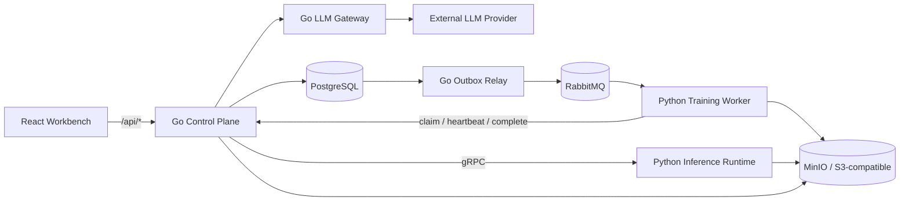

# FineVision

FineVision 是一个细粒度图像分类平台。Phase 1 已将控制面与计算面拆开：Go 负责公开 HTTP、
PostgreSQL 业务状态、事务、任务编排和大模型调用；Python 只负责 Dataset 扫描、特征提取、
训练、校准、阈值计算与数值推理。

## Phase 1 架构



关键边界：

- PostgreSQL 是任务状态的唯一事实源，RabbitMQ 只提供 at-least-once 派发。
- `Job + Training Run + Job Event + Outbox Event` 在同一事务中创建。
- Worker 使用 `attempt_id + execution_epoch` fencing；重复消息、迟到完成和重复完成均有明确语义。
- Feature、模型、报告及输入对象使用 Artifact Descriptor 传递，并校验 SHA-256 与文件大小。
- Go 容器不安装 PyTorch、`timm` 或 CUDA；Python 不直接写控制面业务表。
- 通用 LLM Assistance 保留，但只能提供 advisory 结果；Fine-R1 已从运行时、接口和前端移除。

## 本地启动

首次使用 Git LFS 拉取批准的 DINOv3 ViT-S 权重：

```bash
git lfs install
git lfs pull
```

复制环境配置并启动 CPU-safe 开发栈：

```bash
cp .env.example .env
scripts/demo-up.sh
```

启用 NVIDIA GPU：

```bash
scripts/demo-up.sh --gpu
```

主要服务：

```text
React Workbench          http://localhost:5173
Go Control Plane         http://localhost:8001
MinIO Console            http://localhost:9001
RabbitMQ Management      http://localhost:15672
PostgreSQL               localhost:5432
```

默认配置只适合本地开发。生产环境必须替换数据库、RabbitMQ、MinIO、内部 LLM token 和 provider
凭据，并在网络层限制内部 gRPC/HTTP 端口。

## 服务与目录

```text
go/cmd/control-plane        Go 公开控制面与 Training Lifecycle gRPC
go/cmd/outbox-relay         PostgreSQL Outbox -> RabbitMQ relay
go/cmd/llm-gateway          唯一持有外部 LLM provider 配置的服务
go/internal/training        fenced、幂等的任务状态机
go/internal/artifact        ArtifactStore interface 与完整性规则
backend/src/finevision/compute/queue_worker.py
                            RabbitMQ 训练消费者
backend/src/finevision/compute/inference_runtime.py
                            常驻 Python 数值推理 gRPC 服务
go/api/openapi              公开 HTTP source contract
go/api/proto                Go/Python 内部 RPC source contract
```

Compose 启动三个私有、启用版本控制的 bucket：

- `finevision-datasets`
- `finevision-artifacts`
- `finevision-uploads`

`pretrained-weight-init` 会先校验 Git LFS 中 ViT-S 权重的 SHA-256，再以 content-addressed key
同步到 `finevision-artifacts`，并读回校验。训练产物由 Python 上传，Go 在 complete 事务前再次
读取并校验，校验失败不会生成 succeeded Job 或 Model Version。

## 预训练权重

Phase 1 只纳入 DINOv3 ViT-S/16：

```text
weights/manifest.json
weights/pretrained/dinov3/vit_small_patch16_dinov3.lvd1689m.safetensors
weights/pretrained/dinov3/LICENSE.md
```

ViT-B/L 不在一期发布范围内。Dataset、训练模型、Feature 和报告不得加入 Git LFS，它们属于
ArtifactStore。权重 revision、许可证、SHA-256 和文件大小以 `weights/manifest.json` 为准。

## 示例 Dataset

仓库提供 3 类、12 张、完全合成的 ImageFolder：

```text
data/examples/toy-shapes-imagefolder/
├── blue_triangle/
├── green_circle/
└── red_square/
```

重新生成：

```bash
uv run python scripts/generate_example_dataset.py
```

来源说明及每张图片的 SHA-256 见
[`data/examples/toy-shapes-imagefolder/SOURCE.md`](data/examples/toy-shapes-imagefolder/SOURCE.md)。

## 接口合同

当前 Go source contract 覆盖：

```text
GET    /api/health
GET    /api/datasets
GET    /api/datasets/{dataset_id}
GET    /api/jobs
GET    /api/jobs/{job_id}
GET    /api/model-weights
DELETE /api/model-weights/{preset}
GET    /api/training-runs
POST   /api/training-runs
GET    /api/training-runs/{run_id}
POST   /api/training-runs/{run_id}/{pause|resume|cancel}
POST   /api/llm/assist
```

Training Worker 使用版本化 gRPC 合同执行 `Claim`、`Heartbeat`、`ReportProgress`、`Complete`
和 `Fail`。Python Inference Runtime 暴露 `Predict`、`EvictCache` 和 `Health`，仅接收已校验的
Artifact Descriptor。

更新生成代码：

```bash
scripts/generate-contracts.sh
```

## 测试

Python 与 ViT-S 集成测试：

```bash
uv sync --extra dinov3 --group dev
uv run pytest -q
uv run pytest -q backend/tests/test_dinov3_vits_training_integration.py
```

Go 单元、竞态和静态检查：

```bash
cd go
go test ./...
go test -race ./internal/training ./internal/outbox ./internal/httpapi
go vet ./...
```

真实 PostgreSQL、MinIO、RabbitMQ adapter 集成测试使用以下环境变量显式启用：

```text
FINEVISION_TEST_GO_DATABASE_URL
FINEVISION_TEST_S3_ENDPOINT
FINEVISION_TEST_RABBITMQ_URL
```

前端回归：

```bash
cd frontend
npm ci
npm run build
npm run smoke:api-client
npm run smoke:jobs-client
npm run smoke:training-client
npm run smoke:inference-client
npm run smoke:abstention-client
npm run smoke:review-client
npm run smoke:llm-client
```

## 文档

- [`docs/REFACTOR_PHASE1_PLAN.md`](docs/REFACTOR_PHASE1_PLAN.md)：一期范围、状态机、失败语义和验收项。
- [`docs/TECHNICAL_ARCHITECTURE.md`](docs/TECHNICAL_ARCHITECTURE.md)：框架、模块、接口与工程规范。
- [`docs/CONTROL_PLANE_API.md`](docs/CONTROL_PLANE_API.md)：公开与内部接口合同。
- [`docs/DATABASE_DESIGN.md`](docs/DATABASE_DESIGN.md)：PostgreSQL schema 与迁移说明。
- [`docs/PHASE1_VERIFICATION.md`](docs/PHASE1_VERIFICATION.md)：一期自动化与真实基础设施验证记录。
- [`CONTEXT.md`](CONTEXT.md)：领域统一语言。
- [`AGENTS.md`](AGENTS.md)：后续代理和贡献者必须遵守的边界。

历史 FastAPI 代码只用于迁移期非 Go route 的合同回归，不在 Phase 1 Compose 中启动，也不得
新增控制面写入或外部 LLM 调用。新增公开控制面能力必须落在 Go 中。
