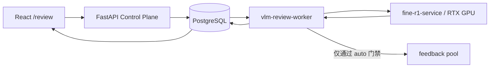

# FineVision Fine-R1 视觉复核工程实现与评测报告

## 1. 结论

Fine-R1-3B 已作为独立 GPU 推理服务接入 FineVision 的人工复核链路。它不替换 DINOv3
分类器，也不参与阈值更新，而是对已经进入 `abstain` 队列的样本执行候选类别约束下的
视觉重排。

当前交付状态：

- `assisted` 已完成：生成 Fine-R1 建议，保留人工最终提交权。
- `auto` 的门禁代码已完成，但默认关闭。只有目标数据集影子评测通过并设置
  `FINEVISION_FINER1_AUTO_ENABLED=true` 后才能创建自动任务。
- `reject_ood` 不进入 Fine-R1 自动提交路径。
- 任务、逐样本结果、候选类别、模型 revision、prompt version、图片 hash、耗时和 token
  数均可追踪。
- 24GB RTX 4090 上 BF16 模型常驻约占 7.0 GiB，工程上可行。

两套小规模细粒度验证得到：

| 数据集 | 样本 | Accuracy | 格式遵从率 | 平均延迟 | 峰值显存 |
| --- | ---: | ---: | ---: | ---: | ---: |
| CUB-200-2011 | 20 | 55% | 95% | 15.91 s | 7.07 GiB |
| Oxford Flowers-102 | 20 | 85% | 100% | 18.00 s | 7.10 GiB |

CUB 中 seen 子集为 80%，unseen 子集仅 30%。因此 Fine-R1 的能力具有明显类别域依赖，
不能把跨数据集可运行误解为跨数据集可靠；默认保留人工复核是必要的产品约束。

## 2. 系统架构



职责边界：

- Control Plane：创建、查询、取消任务，验证 auto 功能开关。
- PostgreSQL：保存 run/result 状态机和审计字段。
- `vlm-review-worker`：领取任务、解析图片、构造候选、调用 GPU、执行门禁、回写结果。
- `fine-r1-service`：只负责模型常驻和单图候选重排，不访问业务数据库。
- Review UI：创建 assisted 任务、显示进度和结果；auto 未开放时明确显示影子评测状态。

Docker profile：

- `--profile vlm`：启动 worker，连接 `FINEVISION_FINER1_SERVICE_URL` 指定的远程 GPU 服务。
- `--profile vlm-local`：同时启动 worker 和本机 GPU 服务。
- 本机 GPU 服务端口只绑定 `127.0.0.1:8010`，不直接暴露公网。

## 3. 数据模型和状态机

迁移：

- `20260726_0008`：新增 `vlm_review_runs`、`vlm_review_results`。
- `20260726_0009`：新增推理耗时、输入 token、生成 token。
- `20260726_0010`：新增跳过计数。

Run 状态：

```text
queued -> running -> succeeded | partial_failed | failed
queued/running -> cancelled
```

Result 状态：

```text
queued -> running -> succeeded | failed
queued/running -> cancelled
queued -> skipped
running --lease expired--> queued | failed
```

并发和恢复约束：

- `FOR UPDATE SKIP LOCKED` 防止多个 worker 同时领取一个 result。
- 创建任务时排除已被活跃 VLM run 占用的 review item。
- 默认 900 秒 lease；过期任务重排，达到 3 次尝试后失败并回退人工。
- 取消会同时取消 queued/running result。
- 自动写反馈前再次锁定并验证 VLM run/result 为 running，避免取消后迟到结果写入反馈。

## 4. API

Control Plane：

```text
POST /api/vlm-review-runs
GET  /api/vlm-review-runs
GET  /api/vlm-review-runs/{run_id}
POST /api/vlm-review-runs/{run_id}/cancel
GET  /api/vlm-review-capabilities
```

GPU 服务：

```text
GET  /health
GET  /ready
POST /v1/rerank
```

`POST /v1/rerank` 输入真实图片 data URL、2-10 个候选类别、数据集摘要和 request id。
输出只能映射到一个候选类别，并包含：

```text
suggested_label, reasoning, raw_output,
model_id, model_revision, prompt_version,
latency_seconds, input_tokens, generated_tokens
```

## 5. Prompt v1.1

设计目标不是让 VLM 自由分类，而是让它在分类器给出的候选空间内做独立视觉比较：

1. 注入数据集摘要，说明任务领域和细粒度线索。
2. 候选顺序随机化，不传 top-1 排名、confidence、margin 和阈值结论，降低锚定偏差。
3. 要求比较形状、颜色、纹理、局部结构和上下文。
4. 强制输出 `<think>...</think><answer>候选标签</answer>`。
5. `<think>` 限制在 180 个英文词，`max_new_tokens=1024`。
6. answer 必须唯一映射到候选，否则该 result 失败并回退人工。

v1 使用 768 token 时，CUB 有 4/20 输出在生成 answer 前被截断。v1.1 扩展到 1024 token
并限制推理长度后，格式遵从率提高到 95%；Flowers-102 保持 100%。

## 6. 自动提交门禁

auto 模式每张图片运行两次，候选顺序采用不同的确定性随机排列。只有同时满足以下条件
才具有自动提交资格：

```text
mode == auto
AND risk_acknowledged == true
AND original_decision == abstain
AND suggested_label belongs to candidates
AND two_pass_labels_are_identical
AND (suggested_label == classifier_top1
     OR suggested_label == nearest_neighbor_majority)
AND original_decision != reject_ood
```

门禁失败只保存 proposal，review item 保持 pending。自动反馈使用
`feedback_metadata.source=vlm_auto`，并记录 run/result、模型 revision、prompt version 和
门禁策略。当前 auto 功能开关默认关闭，因为 20 张工程验证不足以证明目标域风险可控。

## 7. 两数据集实验

### 7.1 实验设置

- 模型：`StevenHH2000/Fine-R1-3B`
- revision：`6da43fdd30df0101bbb81f4ae5ad9e6117bf3619`
- 精度：BF16
- GPU：NVIDIA RTX 4090 24GB
- 解码：`do_sample=false`
- prompt：`finevision-finer1-v1.1`
- 候选数：每张 4 个，顺序按固定 seed 随机化
- CUB：Fine-R1 官方 seen/unseen 题目各 10 张
- Flowers-102：固定 20 张测试图片，候选来自官方 Fine-R1 flower 题目
- LLM 辅助建议未参与评测

### 7.2 结果解读

CUB 的整体 55% 不能视为理想结果。seen 80% 说明模型在熟悉类别上有候选重排价值，
unseen 30% 则说明新鸟种域泛化不足。Flowers-102 的 85% 表明在花卉候选比较上效果较好。
两者差距是保留目标域 shadow benchmark 和人工兜底的直接依据。

本实验只回答“模型能否稳定部署、遵守候选格式、在两个细粒度域中是否有辅助价值”，
不回答“是否达到生产自动复核精度”。后续若要开放 auto，建议每个目标
dataset/model scope 至少评测 200 个已标注 review item，并同时报告：

- candidate rerank accuracy；
- auto gate coverage；
- auto accepted risk；
- fallback rate；
- format failure rate；
- 按类别和 seen/unseen 分组的最差表现。

机器可读摘要位于
`docs/experiments/finer1_benchmark_summary.json`，复现实验入口为
`scripts/finer1_review_benchmark.py`。

## 8. 验收结果

```text
PostgreSQL migration head: 20260726_0010
Backend: 82 passed
Frontend API smoke: all passed
Frontend production build: passed
Docker compose/default/vlm/vlm-local config: passed
Remote /health: passed
Remote /v1/rerank: passed
```

真实端点 smoke 使用 Flowers-102 图片，正确返回 `pink primrose`，耗时 21.53 秒，
输入 577 token、生成 726 token，revision 和 prompt version 与任务配置一致。测试完成后
远端服务已停止，没有遗留 GPU 推理进程。

## 9. 当前边界

- assisted 可用，auto 仍是 shadow-locked，不应宣传为生产自动标注。
- Fine-R1 不负责 OOD 最终判断，`reject_ood` 永远回到人工。
- 当前没有自动反馈撤销 API，因此 auto 默认关闭；开放前应补充回放/撤销和权限控制。
- 远程 GPU 服务正式部署时还需 HTTPS、服务 token、请求大小限制和服务审计日志。
- 小样本结果适合工程决策，不适合写成模型 SOTA 或生产精度结论。
