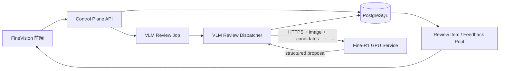

# Fine-R1 VLM 复核接入方案与实验记录

状态：方案已完成，模型已下载，远程试验已完成；生产 API、任务表和前端自动复核任务尚未实现。

## 1. 结论

Fine-R1-3B 适合接入 FineVision，但角色应限定为：

> 对已经进入 `abstain` 复核队列的样本，基于真实图片和候选类别做细粒度视觉重排，生成可审计的 VLM 复核建议；在用户显式创建自动复核任务时，只有通过确定性门禁的结果才能自动提交。

它不应替代以下模块：

- DINOv3 CLS 主分类链路。
- calibration 和风险约束阈值策略。
- OOD distance / OOD score。
- `reject_ood` 的人工确认。
- 数据集版本、模型版本和反馈池治理。

最终推荐配置：

| 配置项 | 选择 |
|---|---|
| 模型 | `StevenHH2000/Fine-R1-3B` |
| 模型 revision | `6da43fdd30df0101bbb81f4ae5ad9e6117bf3619` |
| 精度 | BF16 |
| 推理方式 | 常驻单进程、异步任务、`do_sample=false` |
| 输出上限 | `max_new_tokens=1024` |
| 任务范围 | `abstain` 候选类别重排 |
| OOD 范围 | 仅解释；不能替代现有 OOD 策略 |
| 默认模式 | VLM 建议 + 人工提交 |
| 可选模式 | 用户显式创建自动复核任务，门禁失败则回退人工 |

## 2. 模型与服务器

### 2.1 模型来源

- 模型：[StevenHH2000/Fine-R1-3B](https://huggingface.co/StevenHH2000/Fine-R1-3B)
- 代码：[PKU-ICST-MIPL/FineR1_ICLR2026](https://github.com/PKU-ICST-MIPL/FineR1_ICLR2026)
- 论文：[Fine-R1: Make Multi-modal LLMs Excel in Fine-Grained Visual Recognition by Chain-of-Thought Reasoning](https://arxiv.org/abs/2602.07605)

Fine-R1 基于 Qwen2.5-VL 架构，通过 CoT SFT 和 TAPO 学习“视觉观察、候选类别、差异比较、最终预测”的细粒度识别流程。

### 2.2 已验证环境

| 项目 | 结果 |
|---|---|
| GPU | NVIDIA GeForce RTX 4090，24564 MiB |
| Python | 3.12.7 |
| PyTorch | `2.8.0.dev20250603+cu128` |
| Transformers | `5.14.1` |
| Accelerate | `1.14.0` |
| bitsandbytes | `0.50.0` |
| qwen-vl-utils | `0.0.14` |

模型保存在远程 GPU 服务器：

```text
/gz-data/finer1/models/Fine-R1-3B
```

独立环境：

```text
/gz-data/finer1/env
```

实验与结果：

```text
/gz-data/finer1/experiments
/gz-data/finer1/results
```

模型文件总权重大小为 `8,131,575,808` bytes。两个 safetensors 分片均已使用 `safe_open` 成功读取，分别包含 454 和 371 个 tensor。

纳入项目版本控制的汇总结果：

```text
docs/experiments/finer1_pilot_summary.json
```

## 3. 试验设计

### 3.1 CUB 候选类别重排

从 Fine-R1 官方 CUB closed-world seen/unseen 题目中固定抽取 20 张：

- seen 类别 10 张。
- unseen 类别 10 张。
- 每张图片包含 4 个相近鸟类候选。
- 解码使用 `do_sample=false`。
- 同一批样本分别测试 BF16 CoT、NF4 CoT 和 BF16 直接回答。

这不是完整论文 benchmark，而是用于确定 FineVision 接入方式的小规模工程试验。

### 3.2 OOD 边界试验

从 CIFAR-100 选取 10 张明显非鸟类图片：

```text
apple, keyboard, bicycle, chair, clock,
bottle, bus, tank, television, motorcycle
```

每张图片提供 3 个鸟类类别和 `OOD` 候选，测试 Fine-R1 是否能替代现有 OOD 检测。

### 3.3 指标

- 候选集分类准确率。
- 输出是否能映射回一个合法候选类别。
- 模型显存。
- 推理峰值显存。
- 平均延迟和 P95 延迟。
- 平均生成 token 数。
- 固定解码下的重复运行一致性。

标签后处理会统一大小写、空格、下划线、连字符和英文所有格。例如：

```text
Red-faced Cormorant == Red Faced Cormorant
Nelson's Sharp Tailed Sparrow == Nelson Sharp Tailed Sparrow
```

这只用于映射已有候选，不允许创建候选集之外的新类别。

## 4. 试验结果

### 4.1 总表

| 方案 | 样本 | 准确率 | 合法输出率 | 模型显存 | 平均延迟 | P95 | 平均输出 token |
|---|---:|---:|---:|---:|---:|---:|---:|
| BF16 + CoT | 20 | **100%** | 100% | 7.00 GiB | 11.60 s | 16.00 s | 540.8 |
| NF4 + CoT | 20 | 90% | 100% | 2.26 GiB | 13.76 s | 16.79 s | 461.95 |
| BF16 + 直接回答 | 20 | 65% | 100% | 7.00 GiB | 0.26 s | 0.32 s | 5.75 |
| BF16 + CoT OOD | 10 | 40% OOD recall | 100% | 7.00 GiB | 10.13 s | 13.75 s | 451.1 |

### 4.2 BF16 与 NF4

NF4 相比 BF16：

- 模型显存下降约 67.72%。
- 平均延迟上升约 18.66%。
- 20 张样本准确率下降 10 个百分点。
- 新增两个真实错判：
  - `Nashville Warbler` 被判断为 `Orange Crowned Warbler`。
  - `Black Footed Albatross` 被判断为 `Laysan Albatross`。

RTX 4090 上 BF16 模型只占约 7GB 显存，没有容量压力。NF4 既没有提速，又出现了可见的细粒度质量损失，因此不作为默认生产配置。

NF4 可以保留为低显存设备的兼容选项，但启用前必须重新跑目标数据集验证。

### 4.3 CoT 与直接回答

直接要求模型只输出候选标签，延迟可以下降到约 0.26 秒，但准确率从 100% 降到 65%。

这说明 Fine-R1 的识别能力依赖其训练时的推理过程。不能为了追求低延迟而删除“视觉观察、候选比较、最终判断”流程。

生产方案保留 CoT，并通过异步任务消化延迟。完整 reasoning 作为审计 artifact 保存，前端默认折叠。

### 4.4 OOD

Fine-R1 在 10 张明显非鸟类图片上只获得 40% OOD recall，另外 60% 会被强行吸附到某个鸟类候选。

因此：

- `reject_ood` 不能由 Fine-R1 自动提交。
- OOD 仍由 embedding distance、阈值策略和人工确认负责。
- Fine-R1 可以解释为什么图片与候选类别不一致，但其 OOD 结论只能作为辅助证据。

### 4.5 可复现性

同一 BF16 样本在两个独立运行中得到完全相同的文本输出：

```text
SHA-256:
8218e8d8714f1a003b8e9569d7cd0ea6478cf783bc1a9d90bdebf347ff2f83da
```

成立条件：

- 同一模型 revision。
- 同一 processor。
- 同一 prompt version。
- `do_sample=false`。
- 相同图片和候选类别顺序。

## 5. 最终架构



### 5.1 服务边界

`fine-r1-service` 是独立的 GPU 推理服务：

- 模型常驻显存。
- 不直连 FineVision 数据库。
- 不修改 review、feedback、policy 或 dataset。
- 只接收图片、候选类别和受控上下文。
- 只返回结构化复核建议和运行元数据。

FineVision 控制平面负责：

- 创建和取消自动复核任务。
- 决定哪些 review item 可以进入 VLM 队列。
- 保存结果、状态、prompt version 和模型 revision。
- 执行自动提交门禁。
- 将失败、超时和低一致性结果回退人工。

这样可以让本地 FineVision 和远程 GPU 解耦，也不会把 8GB 权重塞进现有 API 容器。

### 5.2 为什么不用现有 `ml-worker`

现有 `ml-worker` 执行 DINOv3 特征提取和分类头训练。VLM 有不同的环境、模型生命周期和资源特征：

- 需要模型常驻。
- 单次输出延迟约 10 至 16 秒。
- Transformers、bitsandbytes、Qwen VL 依赖与训练环境不同。
- 自动复核需要独立队列、并发限制和取消语义。

因此新增 `vlm-review-worker` / `fine-r1-service`，不把 VLM 逻辑塞进现有训练 worker。

## 6. 输入与提示词

### 6.1 输入来源

传给 VLM：

- 原始图片。
- dataset card 的任务、领域和类别说明。
- DINOv3 产生的 top-k 候选类别名称。
- 可选的类别混淆说明。

不传给 VLM：

- top-k 分数。
- 当前 top-1 排名。
- confidence、margin 和 OOD score 的具体数值。
- 当前阈值决策建议。

这样候选集来自视觉分类器，但 Fine-R1 不会被当前 top-1 和分数锚定。VLM 先看图并比较候选；DINO 分数只在返回后用于系统门禁。

候选顺序应使用记录了 seed 的确定性打乱，减少顺序偏置。

### 6.2 Prompt v1

```text
你是 FineVision 的细粒度视觉复核模型。

任务领域：
{dataset_summary}

请以图片像素为主要证据，观察主体的形态、颜色、纹理、局部结构和可见环境，
再比较以下候选类别：
{candidate_labels}

模型已有分类结果可能不可靠，不要根据候选顺序猜测答案。
不得生成候选列表之外的新类别。

输出：
<think>视觉观察、候选比较和不确定点</think>
<answer>候选类别原文</answer>
```

推理参数：

```text
do_sample=false
max_new_tokens=1024
use_cache=true
dtype=bfloat16
```

### 6.3 结构化结果

GPU 服务返回：

```json
{
  "review_item_id": "review-...",
  "model_id": "StevenHH2000/Fine-R1-3B",
  "model_revision": "6da43fdd30df0101bbb81f4ae5ad9e6117bf3619",
  "precision": "bf16",
  "prompt_version": "finevision-finer1-review-v1",
  "suggested_label": "Nashville Warbler",
  "matched_candidate": true,
  "reasoning_artifact_uri": "artifact://...",
  "latency_ms": 11596,
  "generated_tokens": 541
}
```

`suggested_label` 必须经过候选映射。无法唯一映射时返回失败，不做模糊猜测。

## 7. 自动复核门禁

### 7.1 默认辅助模式

默认行为保持不变：

```text
VLM proposal -> 人工查看 -> 人工提交 -> feedback pool
```

VLM 不直接写最终标签。

### 7.2 用户显式自动模式

用户在 `/review` 右侧的“LLM 主导队列”创建任务后，才允许自动提交。

自动提交必须同时满足：

1. review item 状态为 `pending`。
2. 原始 decision 为 `abstain`，不能是 `reject_ood`。
3. 图片可以读取且通过基本坏图检查。
4. VLM 输出能唯一映射到 dataset taxonomy 中的一个候选。
5. 模型 revision、prompt version、输入候选和原始图片 hash 已留痕。
6. VLM 结论至少与一个独立信号一致：
   - DINO top-1；或
   - 近邻标签多数结果。
7. 用户创建任务时明确选择了自动提交并确认风险。

门禁不满足时：

```text
保存 VLM proposal -> 保持 pending -> 回退人工
```

自动结果需要单独标记：

```text
review_source = vlm_auto
reviewed_by = fine-r1-service
```

不能伪装成人工标签，也不能未经治理直接进入训练集。

## 8. 任务模型

建议新增两类记录。

### 8.1 `vlm_review_runs`

关键字段：

- `id`
- `inference_run_id`
- `dataset_version_id`
- `model_version_id`
- `mode`: `assist` / `auto`
- `status`: `queued` / `running` / `paused` / `completed` / `failed` / `cancelled`
- `model_id`
- `model_revision`
- `precision`
- `prompt_version`
- `candidate_policy`
- `created_by`
- `created_at`
- `started_at`
- `completed_at`

### 8.2 `vlm_review_results`

关键字段：

- `id`
- `vlm_review_run_id`
- `review_item_id`
- `status`
- `suggested_label`
- `matched_candidate`
- `auto_gate_passed`
- `auto_gate_reasons`
- `latency_ms`
- `generated_tokens`
- `reasoning_artifact_id`
- `error`

任务必须支持暂停、取消、重试失败项和查看进度。

## 9. API 草案

控制平面：

```text
POST   /api/vlm-review-runs
GET    /api/vlm-review-runs
GET    /api/vlm-review-runs/{id}
POST   /api/vlm-review-runs/{id}/pause
POST   /api/vlm-review-runs/{id}/resume
POST   /api/vlm-review-runs/{id}/cancel
GET    /api/vlm-review-runs/{id}/results
```

远程 GPU 服务：

```text
GET  /health
GET  /ready
POST /v1/review/classify
```

GPU 服务只监听内网或 SSH tunnel。正式暴露时必须加 HTTPS、服务 token、请求大小限制和审计日志。

## 10. 实施顺序

1. 实现只读 `fine-r1-service`，完成 health、ready 和单图候选重排。
2. 新增 VLM review run/result 数据模型和迁移。
3. 新增 dispatcher，先只支持 `assist`。
4. 把 `/review` 的方案 C 占位入口接到真实任务页。
5. 完成暂停、取消、失败重试和进度显示。
6. 对目标数据集运行至少 200 张 shadow benchmark。
7. 在默认关闭状态下增加 `auto` 门禁。
8. 验收通过后再允许用户创建自动提交任务。

## 11. 当前限制

- 20 张 CUB 是接入决策试验，不是完整精度声明。
- Fine-R1 的长 CoT 延迟不适合同步页面请求。
- Fine-R1 不能可靠判断 OOD。
- VLM 自评 confidence 不能作为自动门禁的可信概率。
- NF4 在本次试验中出现质量下降，不能只凭显存收益启用。
- 自动复核产生的反馈必须与人工反馈分源统计。

## 12. 验收标准

- BF16 模型可以在 24GB GPU 上常驻，健康检查稳定。
- 每个结果记录模型 revision、prompt version、图片 hash 和候选列表。
- 输出不在候选集时不会自动提交。
- `reject_ood` 永远不会由 Fine-R1 自动提交。
- VLM 服务失败不会阻塞人工复核。
- 默认模式仍然是人工最终提交。
- 自动模式必须由用户显式创建任务。
- 自动结果与人工结果在反馈池中可区分、可回放、可撤销。
