# FineVision 项目展示文档与操作手册

生成日期：2026-06-27  
源文档：`docs/FineVision_项目展示文档与操作手册.md`  
展示入口：`docs/FINEVISION_SHOWCASE_MANUAL.html`  
项目定位：面向细粒度视觉分类任务的模型控制平面原型。

> 这份文档用于说明 FineVision 的产品目标、操作流程、工程架构和实验结果。FineVision 的真实训练和批量推理依赖 GPU，因此本文重点展示系统设计、核心页面、算法链路和可量化评估结果。

## 0. 展示导航与页面路由

### 0.1 文档模块

本文档分为四个主体部分：

1. 项目介绍：说明 FineVision 解决什么问题、为什么不是普通分类 demo。
2. 操作手册：按页面路由讲解每个页面如何使用，并配有截图批注。
3. 项目实现细节：说明前后端架构、服务拆分、数据库、worker、算法、LLM 提示词和阈值策略。
4. 评估测试报告：说明如何量化 selective classification / OOD rejection 策略的价值。
5. 附录：提供 API、数据库、前端路由和容器职责的工程参考。

### 0.2 产品页面路由

| 模块 | 路由 | 用途 | 展示重点 |
|---|---|---|---|
| 工作台 | [`/`](#route-dashboard) | 查看全局状态和待处理事项 | 证明系统不是单页 demo，而是工作台 |
| 数据集列表 | [`/datasets`](#route-datasets) | 导入和管理数据集 | ImageFolder 导入、数据集摘要、状态管理 |
| 数据集详情 | [`/datasets/:datasetId`](#route-dataset-detail) | 检查类别、样本和摘要 | 数据集版本、真实样本预览、类别空间 |
| 权重管理 | [`/weights`](#route-weights) | 查看 DINOv3 backbone 权重 | ViT-S / ViT-L 缓存、路径、大小、删除 |
| 训练队列 | [`/training`](#route-training) | 新建和管理训练任务 | 队列、筛选、状态、推荐配置 |
| 训练详情 | [`/training/:runId`](#route-training-detail) | 查看一次训练的产物和指标 | 特征缓存、分类头、校准、阈值策略 |
| 推理实验室 | [`/inference`](#route-inference) | 单图或文件夹推理 | top-k、阈值解释、复核路由、LLM 辅助 |
| 人工复核队列 | [`/review`](#route-review) | 批量处理不确定样本 | pending / submitted、分页、数据集过滤 |
| 复核详情 | [`/review/:reviewItemId`](#route-review-detail) | 对单张图片做最终人工判断 | 图像、模型证据、LLM 建议、最终标签 |
| 反馈池 | [`/feedback`](#route-feedback) | 管理复核结论和策略候选 | 反馈不直接污染训练集、阈值策略 shadow |
| 模型版本 | [`/models`](#route-models) | 管理候选模型 | 候选模型、血缘、门禁状态 |
| 模型详情 | [`/models/:modelId`](#route-model-detail) | 查看模型产物完整性 | 指标、artifact、校准和推理入口 |
| 流水线 | [`/pipelines`](#route-pipelines) | 查看后台任务和 worker 状态 | API / worker 边界、job event、失败排查 |

## 1. 项目介绍

### 1.1 一句话介绍

FineVision 是一个面向视觉分类任务的可审计模型工作台。它把数据集导入、DINOv3 特征提取、分类头训练、校准阈值、推理实验、人工复核、反馈池和在线可弃权阈值策略串成闭环，让模型结果不仅“能预测”，而且能被追踪、被复核、被量化评估。

### 1.2 为什么要做这个项目

普通分类模型 demo 往往只回答一个问题：

```text
这张图片预测成什么类别？
```

但真实算法平台还必须回答更多问题：

- 这个模型是用哪个数据集版本训练出来的？
- 训练时用的是哪个 backbone、哪个图像分辨率、哪个分类头？
- 特征缓存、分类头权重、校准报告、阈值策略在哪里？
- 模型不确定时，是直接给出可能错误的答案，还是进入人工复核？
- 人工复核后的结论如何进入反馈池，而不是直接污染训练集？
- 阈值调整有没有量化目标，例如控制自动接受错误率，并降低人工复核成本？
- LLM 辅助是否只是建议，还是会越权写标签、改阈值、改训练集？

FineVision 的价值在于把这些问题产品化，形成一条可演示、可审计、可扩展的 MLOps 闭环。

### 1.3 产品目标

FineVision 当前阶段不是追求端到端训练 SOTA，而是追求“平台链路扎实”：

- 数据集必须有版本和摘要。
- 训练必须产生可追踪产物。
- 推理必须记录事件。
- 不确定样本必须进入人工复核。
- 人工结论必须进入反馈池。
- 阈值策略必须可解释、可回放、可人工激活。
- LLM 必须 advisory-only，不能替代人工真值。

### 1.4 核心闭环

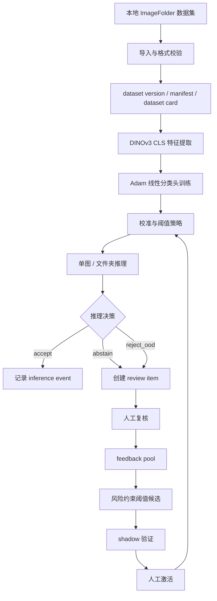
```mermaid
flowchart TD
  A["本地 ImageFolder 数据集"] --> B["导入与格式校验"]
  B --> C["dataset version / manifest / dataset card"]
  C --> D["DINOv3 CLS 特征提取"]
  D --> E["Adam 线性分类头训练"]
  E --> F["校准与阈值策略"]
  F --> G["单图 / 文件夹推理"]
  G --> H{"推理决策"}
  H -->|accept| I["记录 inference event"]
  H -->|abstain| J["创建 review item"]
  H -->|reject_ood| J
  J --> K["人工复核"]
  K --> L["feedback pool"]
  L --> M["风险约束阈值候选"]
  M --> N["shadow 验证"]
  N --> O["人工激活"]
  O --> F
```

### 1.5 当前完成度

| 能力 | 当前状态 | 说明 |
|---|---|---|
| 数据集导入 | 已完成 | 支持本地文件夹选择、ImageFolder 校验、复制到项目目录 |
| 数据集摘要 | 已完成 | 可用 LLM 根据类别标签生成摘要，并支持编辑 |
| 权重管理 | 已完成 | 支持查看 ViT-S / ViT-L 等 DINOv3 权重缓存 |
| 特征提取 | 已完成 | 使用 DINOv3 CLS token 作为 frozen feature |
| 分类头训练 | 已完成 | 使用 Adam 训练线性分类头 |
| 校准 | 已完成 | temperature scaling，生成校准和阈值报告 |
| 推理 | 已完成 | 支持单图和文件夹批量推理 |
| 人工复核 | 已完成 | abstain / reject_ood 自动进入复核队列 |
| 反馈池 | 已完成 | 复核结论进入不同 destination，不直接写回训练集 |
| LLM 辅助 | 已完成 | 结构化 advisory-only 输出，支持图像上下文 |
| 在线可弃权第一阶段 | 已完成 | 风险约束阈值策略，shadow-first，人工激活 |
| 生产发布 | 不在当前范围 | 当前是候选模型控制平面，不做真正生产发布系统 |

## 2. 操作手册

### 2.1 启动与访问

本地开发环境启动：

```bash
docker compose up -d postgres api ml-worker frontend
```

访问地址：

```text
Frontend: http://localhost:5173
API:      http://localhost:8001
Adminer:  http://localhost:8081
```

如果需要检查服务状态：

```bash
docker compose ps
docker compose logs -f api
docker compose logs -f ml-worker
```

### 2.2 工作台 `/` {#route-dashboard}

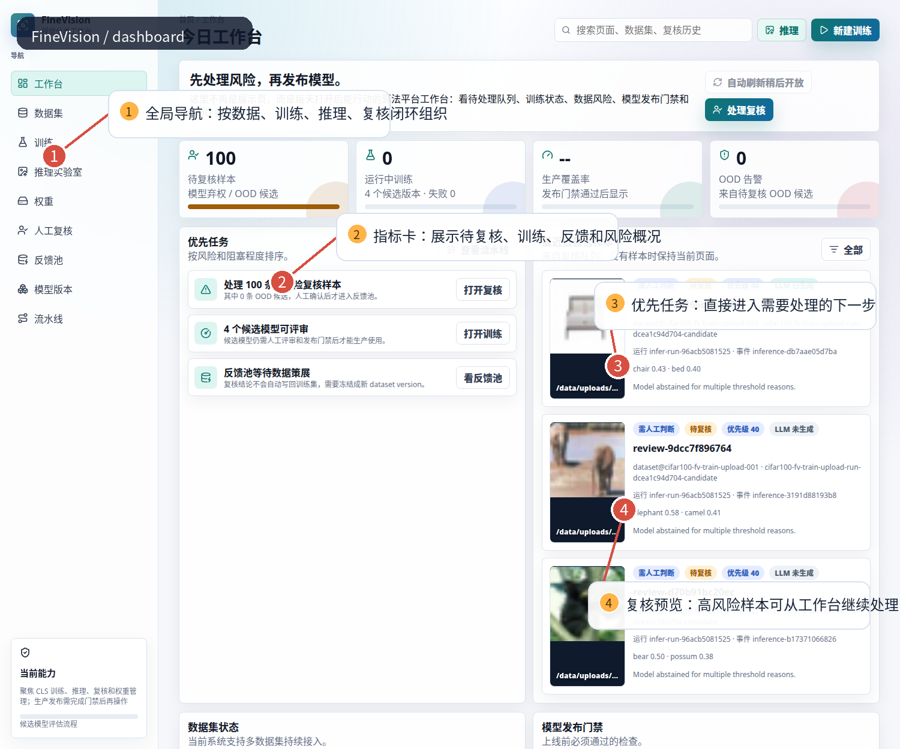

工作台是进入系统后的总览页面。

页面重点：

- `1` 全局导航：按算法平台工作流组织模块。
- `2` 指标卡：展示待复核、训练、反馈和风险状态。
- `3` 优先任务：告诉用户当前最需要处理什么。
- `4` 复核预览：把高风险样本直接暴露在首页。

推荐操作：

1. 打开系统后先看工作台。
2. 如果有待复核样本，优先进入人工复核。
3. 如果最近训练失败，进入训练详情或流水线排查。
4. 如果反馈池积累到一定数量，再考虑生成新的阈值策略。

展示讲法：

```text
这里不是普通预测页面，而是算法工作台。首页展示的是模型链路状态、复核压力和下一步动作。
```

### 2.3 数据集列表 `/datasets` {#route-datasets}

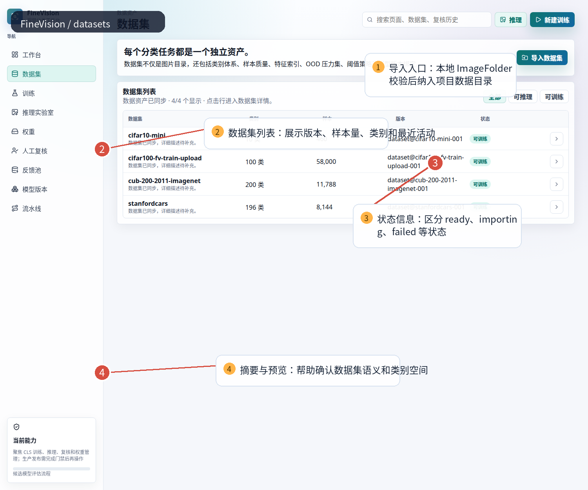

数据集列表用于管理所有已导入的数据资产。

页面重点：

- `1` 导入入口：选择本地 ImageFolder 文件夹。
- `2` 数据集列表：展示 dataset version、样本量、类别数和状态。
- `3` 生命周期状态：区分 ready、importing、failed。
- `4` 摘要与样本预览：帮助确认数据集语义。

支持的数据集格式：

```text
dataset_root/
  train/
    class_a/
      xxx.jpg
    class_b/
      yyy.jpg
  val/
    class_a/
    class_b/
  test/
    class_a/
    class_b/
```

如果没有显式 `train / val / test`，也可以使用：

```text
dataset_root/
  class_a/
    xxx.jpg
  class_b/
    yyy.jpg
```

系统会按类别目录解析，并生成内部 split。

导入时系统会做的事情：

1. 校验文件类型是否为支持的图片类型。
2. 校验是否存在类别目录。
3. 统计类别数和样本数。
4. 复制数据集到项目数据目录。
5. 生成 dataset manifest。
6. 创建 dataset version。
7. 生成或初始化 dataset card。

### 2.4 数据集详情 `/datasets/:datasetId` {#route-dataset-detail}

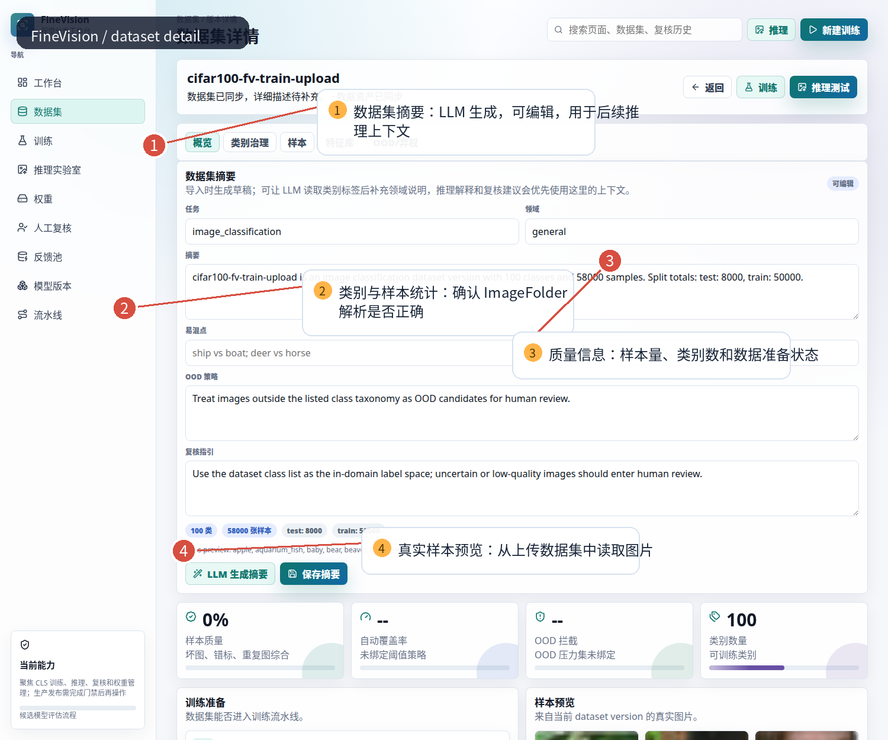

数据集详情页用于确认一个数据集版本是否可以进入训练和推理。

页面重点：

- `1` 数据集摘要：根据类别标签生成，可编辑。
- `2` 类别与样本统计：检查 ImageFolder 是否解析正确。
- `3` 质量信息：展示样本量、类别数、split 和准备状态。
- `4` 真实样本预览：从上传的数据集中读取图片。

数据集摘要的作用：

- 给用户快速理解数据集领域。
- 给 LLM 作为后续推理和复核上下文。
- 帮助判断 OOD，例如 CIFAR-100 数据集遇到数字图片时应视为分布外。

操作建议：

1. 导入后先看类别数量是否符合预期。
2. 打开样本预览，确认不是占位图。
3. 检查 dataset card 是否准确。
4. 如果摘要不准确，先手动编辑，再进入训练。

### 2.5 权重管理 `/weights` {#route-weights}

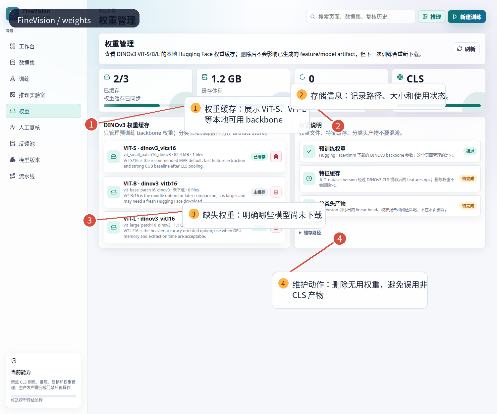

权重页用于管理 DINOv3 backbone 本地缓存。

页面重点：

- `1` 当前可用权重：例如 ViT-S、ViT-L。
- `2` 权重路径和大小。
- `3` 未下载权重：避免训练时误以为可用。
- `4` 删除动作：清理不再使用的权重。

当前推荐：

| 模型 | 用途 |
|---|---|
| ViT-S | 快速验证流程、调试数据集 |
| ViT-L | 最终评估、展示指标 |
| ViT-B | 可作为中间档，当前不是主链路 |

### 2.6 训练队列 `/training` {#route-training}

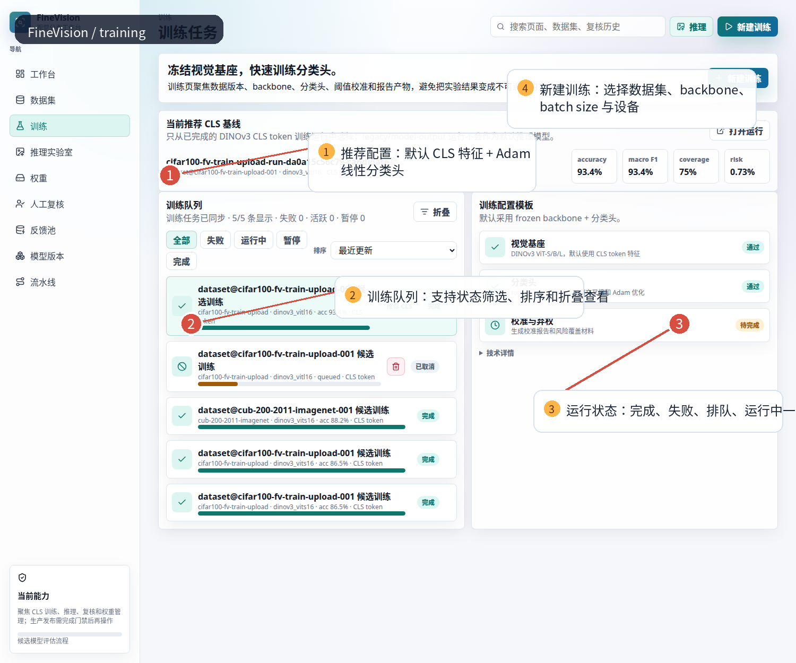

训练页用于创建训练任务和查看训练队列。

页面重点：

- `1` 推荐配置：DINOv3 CLS 特征 + Adam 线性分类头。
- `2` 队列筛选：按全部、失败、运行中、完成过滤。
- `3` 状态标签：完成、失败、排队、运行中。
- `4` 新建训练：选择数据集、backbone、batch size 和设备。

训练任务内部阶段：

```text
dataset snapshot
-> feature extraction
-> classifier training
-> calibration
-> threshold strategy
-> model version registration
```

注意事项：

- ViT-L 权重和特征提取较慢，建议先用 ViT-S 验证。
- GPU 环境下提取特征和训练分类头都应使用 cuda。
- 如果队列不动，应先看流水线 job event，而不是重复创建任务。

### 2.7 训练详情 `/training/:runId` {#route-training-detail}

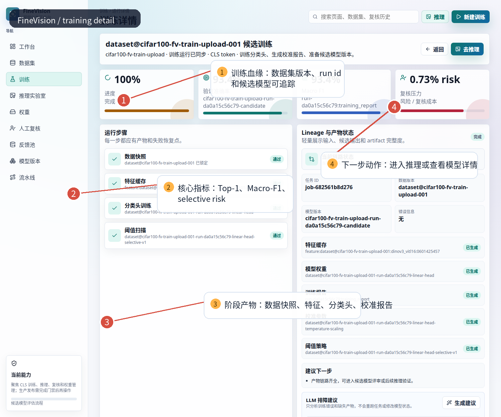

训练详情页用于审计一次训练的完整过程。

页面重点：

- `1` 训练血缘：dataset version、run id、candidate model。
- `2` 核心指标：Top-1、Macro-F1、selective risk。
- `3` 阶段产物：数据快照、特征缓存、分类头、校准报告、阈值策略。
- `4` 下一步动作：进入推理或模型详情。

一次成功训练会产出：

| 产物 | 作用 |
|---|---|
| dataset snapshot | 锁定训练所用数据版本 |
| feature artifact | 保存 CLS 特征和 sample id 映射 |
| model artifact | 保存线性分类头和类别映射 |
| calibration report | 保存温度缩放和校准指标 |
| threshold strategy | 保存 accept/margin/OOD 阈值 |
| training report | 保存准确率、F1、配置和错误信息 |

当前 CIFAR-100 ViT-L 示例：

```text
model_version: cifar100-fv-train-upload-run-da0a15c56c79-candidate
backbone: dinov3_vitl16
feature_pool: cls
head: torch_linear_adam
image_size: 448
top1 accuracy: 93.39%
macro F1: 93.37%
selective risk: 0.73%
```

### 2.8 推理实验室 `/inference` {#route-inference}

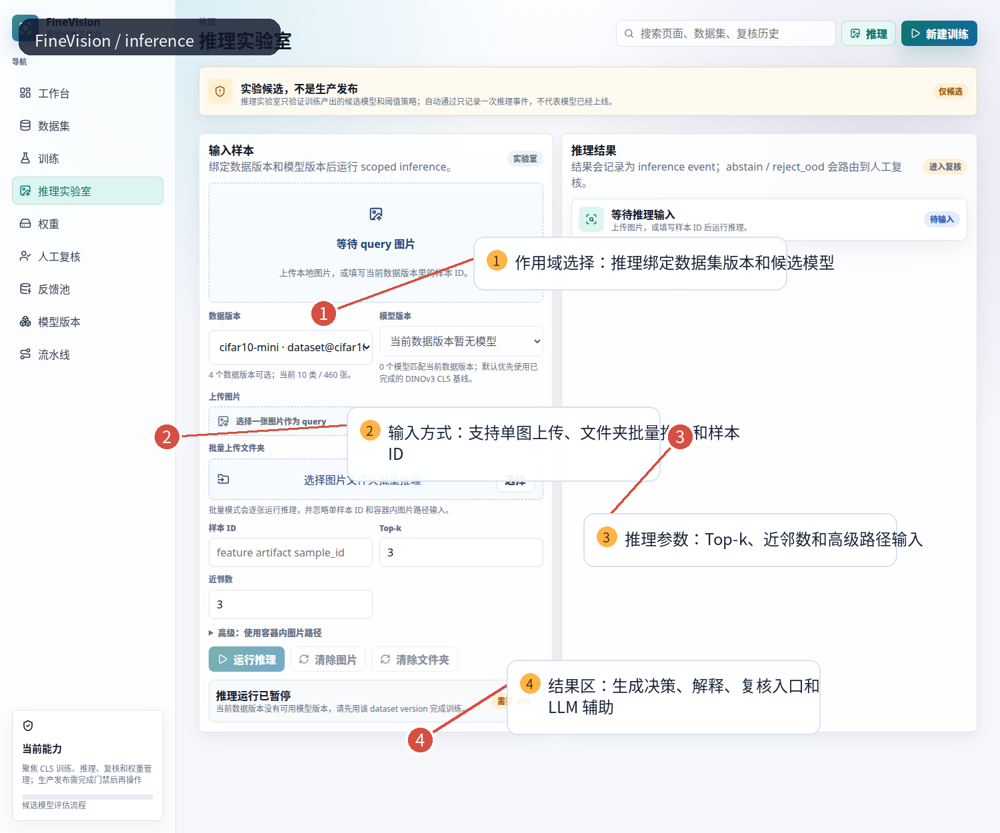

推理实验室用于验证候选模型在真实输入上的表现。

页面重点：

- `1` 作用域选择：推理必须绑定 dataset version 和 model version。
- `2` 输入方式：单图上传、文件夹批量推理、样本 ID。
- `3` 参数区：top-k、近邻数、高级路径输入。
- `4` 结果区：decision、top-k、解释、复核入口、LLM 辅助。

推理会生成：

- inference run：一批推理任务的 id。
- inference event：单张图片的推理事件。
- review item：abstain / reject_ood 或批量复核样本。
- LLM assistance：可选，只读建议。

推荐演示：

1. 选择 CIFAR-100 dataset version。
2. 选择对应 ViT-L candidate model。
3. 上传一张 CIFAR-100 图片。
4. 查看 top-k、confidence、margin、OOD score。
5. 上传一批文件夹图片。
6. 打开复核队列，看样本是否关联到同一个 inference run。

### 2.9 人工复核队列 `/review` {#route-review}

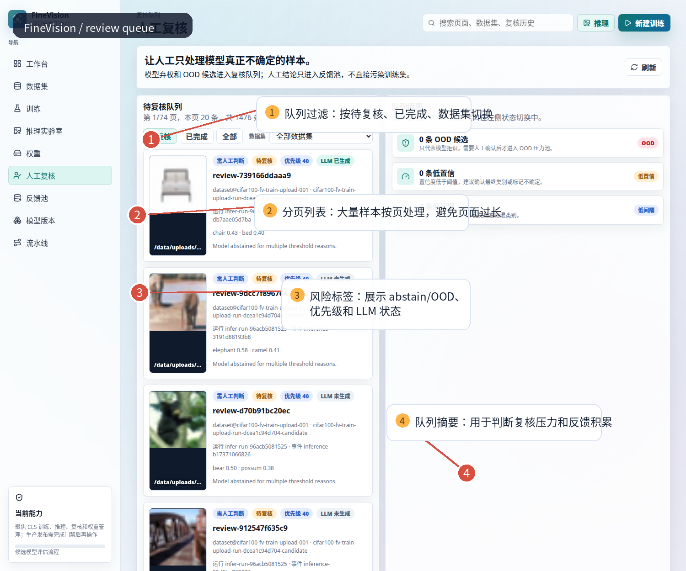

复核队列接收模型不确定或疑似 OOD 的样本。

页面重点：

- `1` 状态过滤：待复核、已完成、全部。
- `2` 分页列表：适合批量推理后的大量样本。
- `3` 风险标签：显示 priority、decision、LLM 状态。
- `4` 队列摘要：查看复核压力。

进入复核队列的规则：

```text
accept      -> 只记录 inference event
abstain     -> 创建 review item
reject_ood  -> 创建 review item
```

批量推理时，每个 review item 会关联：

- dataset version
- model version
- inference run id
- inference event id
- input image path
- top-k 和阈值证据

### 2.10 复核详情 `/review/:reviewItemId` {#route-review-detail}

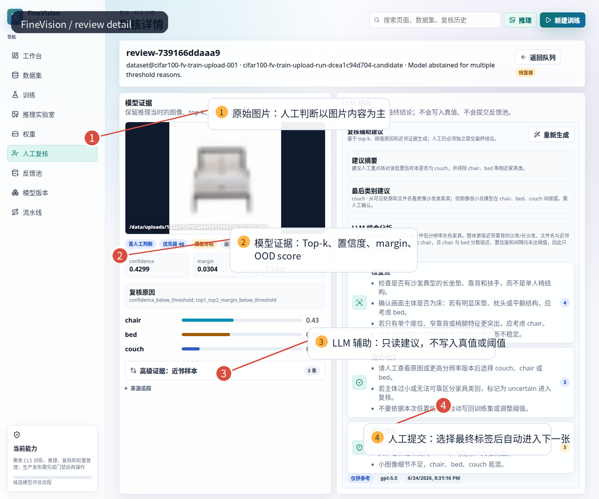

复核详情页是人工判断单张样本的核心页面。

页面重点：

- `1` 原始图片：人工判断以图片内容为主。
- `2` 模型证据：top-k、confidence、margin、OOD score。
- `3` LLM 辅助：只读建议，不写入真值或阈值。
- `4` 人工提交：选择最终标签后自动进入下一张。

人工复核结论：

| 结论 | 进入哪里 | 说明 |
|---|---|---|
| corrected class | training_candidate | 后续可作为新 dataset version 候选 |
| OOD | ood_stress | 用于压力测试或 OOD 阈值策略 |
| bad image | bad_image | 坏图、损坏、不可判定图片 |
| uncertain | taxonomy_dispute | 类别边界不清，后续人工讨论 |
| ignore | ignore | 不进入后续数据闭环 |

重要原则：

```text
人工最终结论才是反馈池输入。
LLM 建议不会自动提交。
模型 top-1 不能覆盖清晰图像证据。
```

### 2.11 反馈池 `/feedback` {#route-feedback}

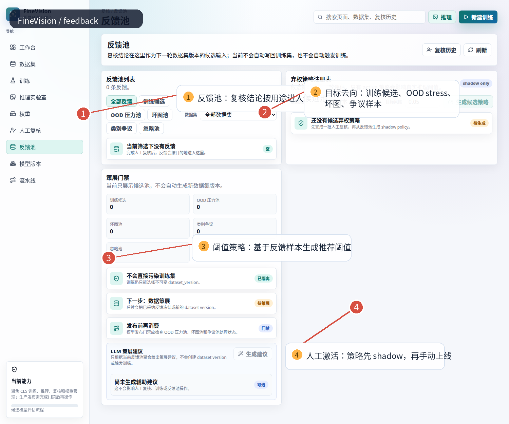

反馈池是人工复核结论的暂存区。

页面重点：

- `1` 反馈列表：查看已经复核过的样本。
- `2` 目标去向：训练候选、OOD stress、坏图、争议、忽略。
- `3` 阈值策略：基于反馈样本生成推荐阈值。
- `4` 人工激活：策略先 shadow，再手动上线。

为什么反馈池不直接写回训练集：

- 防止错误复核立刻污染训练集。
- 允许后续做数据策展和版本审核。
- 保留“复核结论”和“训练数据版本”之间的审计边界。

### 2.12 模型版本 `/models` {#route-models}

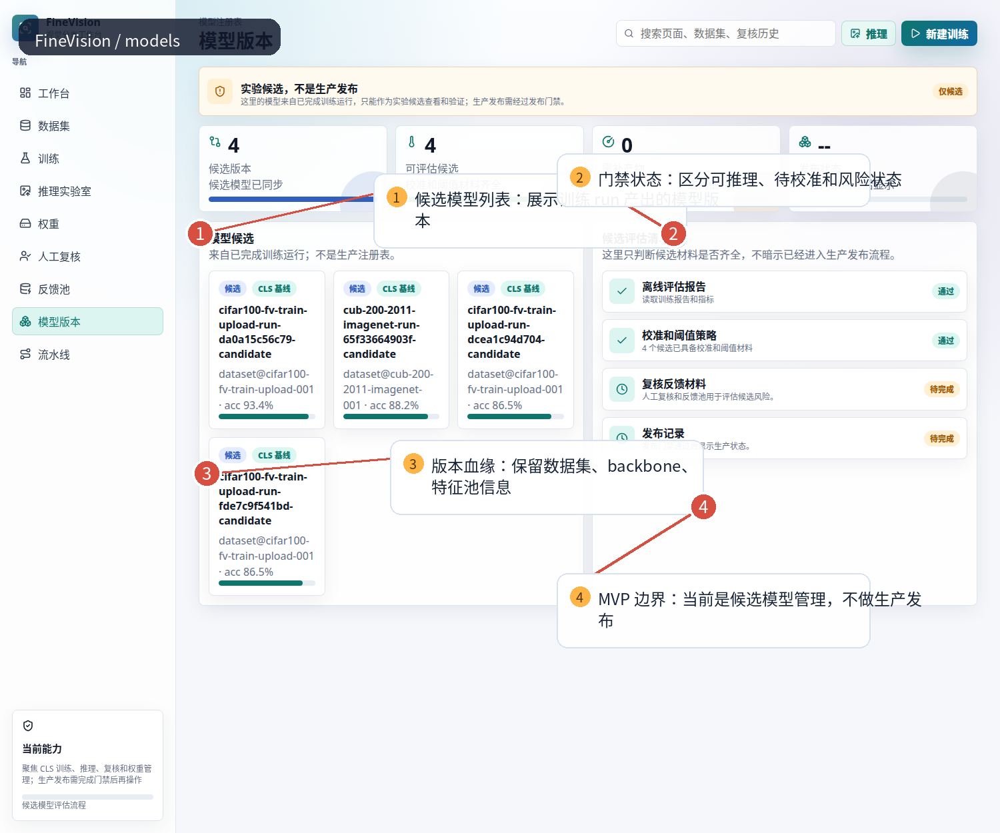

模型版本页用于管理训练产出的 candidate model。

页面重点：

- `1` 候选模型列表。
- `2` 门禁状态。
- `3` 版本血缘。
- `4` 当前不是生产发布系统。

模型版本记录：

- dataset version
- training run id
- backbone
- feature pool
- classifier head
- metrics
- artifact ids
- threshold strategy

### 2.13 模型详情 `/models/:modelId` {#route-model-detail}

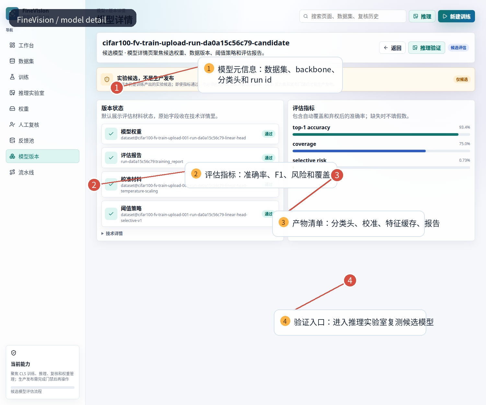

模型详情页用于查看某个 candidate model 的完整信息。

页面重点：

- `1` 模型元信息。
- `2` 评估指标。
- `3` 产物清单。
- `4` 复测入口。

讲解要点：

```text
这里证明每个模型不是孤立文件，而是有训练血缘、指标、产物和阈值策略的候选版本。
```

### 2.14 流水线 `/pipelines` {#route-pipelines}

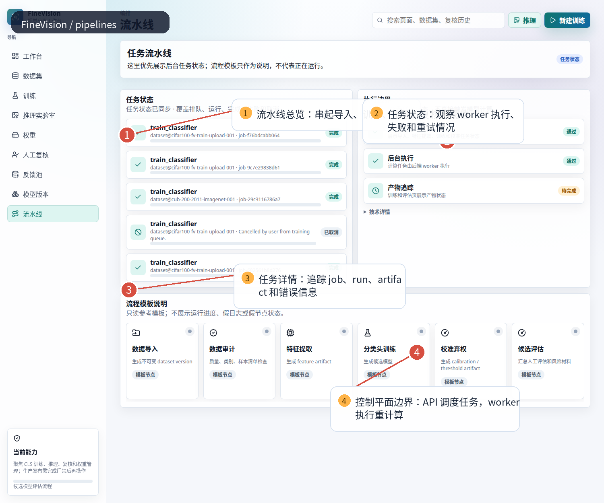

流水线页用于观察后台任务。

页面重点：

- `1` 总览：串起导入、训练、推理、复核和阈值。
- `2` 任务状态：worker 执行、失败、重试。
- `3` 任务详情：job、run、artifact、错误信息。
- `4` 控制平面边界：API 调度，worker 计算。

排错路径：

```text
页面错误
-> 查看对应 run detail
-> 查看 pipeline job event
-> 查看 api / ml-worker docker logs
-> 检查 GPU、权重、数据路径和 artifact
```

## 3. 项目实现细节

### 3.1 架构总览

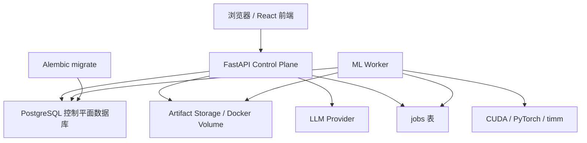
```mermaid
flowchart TB
  Browser["浏览器 / React 前端"] --> API["FastAPI Control Plane"]
  API --> DB["PostgreSQL 控制平面数据库"]
  API --> ART["Artifact Storage / Docker Volume"]
  API --> LLM["LLM Provider"]
  API --> JOB["jobs 表"]
  WORKER["ML Worker"] --> JOB
  WORKER --> DB
  WORKER --> ART
  WORKER --> GPU["CUDA / PyTorch / timm"]
  MIGRATE["Alembic migrate"] --> DB
```

FineVision 的架构不是把所有东西塞进一个后端进程，而是拆成：

| 层 | 服务 | 职责 |
|---|---|---|
| 展示层 | `frontend` | React/Vite 页面、路由、表单、状态展示 |
| 控制平面 | `api` | 轻量接口、元数据、复核、反馈、LLM、任务创建 |
| 计算平面 | `ml-worker` | 数据导入、特征提取、训练、校准、批量任务 |
| 迁移 | `migrate` | Alembic 数据库迁移 |
| 数据库 | `postgres` | 元数据、状态、血缘、事件、策略 |
| DB 管理 | `adminer` | 本地数据库查看 |

### 3.2 为什么这样拆分

核心原则：

```text
API 负责快请求。
Worker 负责慢计算。
PostgreSQL 负责状态和关系。
Artifact storage 负责大文件。
GPU 只暴露给真正需要计算的服务。
```

如果把训练、特征提取、批量推理都放进 API 请求里，会带来问题：

- 请求超时。
- API 被 GPU 任务阻塞。
- 任务失败后难以恢复。
- 前端无法准确展示进度。
- 训练日志和产物难以审计。

所以当前采用“模块化单体 + 独立 worker 进程”的方式。它不是过早拆成多个微服务，但已经把控制平面和计算平面隔离开。

### 3.3 Docker 服务边界

Docker Compose 当前服务边界：

```text
frontend  -> 浏览器页面，端口 5173
api       -> FastAPI，端口 8001，对外提供 /api/*
ml-worker -> 后台任务执行器，使用 GPU
migrate   -> Alembic upgrade head
postgres  -> 控制平面数据库，端口 5432
adminer   -> 数据库查看工具，端口 8081
```

GPU 配置：

```yaml
api:
  gpus: all
  environment:
    FINEVISION_DINOV3_DEVICE: cuda

ml-worker:
  gpus: all
  environment:
    FINEVISION_DINOV3_DEVICE: cuda
    FINEVISION_LINEAR_HEAD_DEVICE: cuda
```

虽然 API 也可以访问 GPU，但原则上重计算应由 worker 执行。API 侧 GPU 主要服务于局部推理和工具函数兼容。

### 3.4 后端 API 模块

后端核心模块：

| 模块 | 作用 |
|---|---|
| `api/app.py` | FastAPI 路由定义 |
| `api/store.py` | dataset manifest / dataset card 本地适配 |
| `api/inference_store.py` | 推理上下文、模型产物、阈值策略读取 |
| `api/review_store.py` | review item 和 feedback item 持久化 |
| `api/abstention_store.py` | 阈值策略生成、shadow、激活、停用 |
| `api/llm.py` | LLM structured output、提示词、fallback |
| `ml_toolkit/features.py` | DINOv3 特征提取 |
| `ml_toolkit/training.py` | 分类头训练 |
| `ml_toolkit/calibration.py` | temperature scaling |
| `ml_toolkit/thresholds.py` | 阈值扫描 |
| `ml_toolkit/online_abstention.py` | 风险约束弃权策略 |
| `worker/jobs.py` | 后台 job 执行 |

### 3.5 关键 API

数据集：

```text
POST /api/datasets/import-imagefolder
GET  /api/datasets
GET  /api/datasets/{dataset_id}
GET  /api/dataset-versions/{dataset_version_id}/sample-previews
POST /api/dataset-versions/{dataset_version_id}/dataset-card/generate
PUT  /api/dataset-versions/{dataset_version_id}/dataset-card
```

训练：

```text
POST /api/training-runs
GET  /api/training-runs
GET  /api/training-runs/{run_id}
POST /api/training-runs/{run_id}/cancel
DELETE /api/training-runs/{run_id}
```

推理：

```text
POST /api/inference
POST /api/inference/upload
POST /api/inference/upload-folder
GET  /api/inference-runs
GET  /api/inference-runs/{run_id}
```

复核与反馈：

```text
GET  /api/review-items
GET  /api/review-items/{review_item_id}
POST /api/review-items/{review_item_id}/submit
POST /api/review-items/{review_item_id}/assist
GET  /api/feedback-items
```

LLM 与策略：

```text
POST /api/llm/assist
POST /api/abstention-policies/propose
GET  /api/abstention-policies
GET  /api/abstention-policies/{policy_id}
POST /api/abstention-policies/{policy_id}/activate
POST /api/abstention-policies/{policy_id}/deactivate
```

### 3.6 数据库设计

MVP 使用 PostgreSQL 作为唯一控制平面数据库。

核心表：

| 表 | 作用 |
|---|---|
| `datasets` | 业务数据集 |
| `dataset_versions` | 不可变数据集快照 |
| `artifacts` | 统一产物注册表 |
| `jobs` | 后台任务状态 |
| `job_events` | append-only 任务事件 |
| `training_runs` | 训练运行 |
| `model_versions` | 候选模型 |
| `inference_runs` | 一批推理 |
| `inference_events` | 单样本推理事件 |
| `review_items` | 人工复核项 |
| `feedback_items` | 复核反馈 |
| `abstention_policy_versions` | 阈值策略版本 |
| `abstention_shadow_decisions` | shadow 策略回放记录 |

存储拆分：

```text
PostgreSQL:
  元数据、状态、关系、审计、策略

Artifact storage:
  图片、manifest、features.npz、模型权重、校准报告、阈值报告

模型权重缓存:
  HuggingFace / Torch cache
```

### 3.7 Artifact 设计

FineVision 不把大文件塞进数据库，而是用 artifact registry 记录：

- artifact key
- artifact type
- dataset version
- job id
- URI / path
- checksum
- metadata

常见 artifact：

| Artifact | 内容 |
|---|---|
| `dataset_manifest` | 样本路径、类别、split、readiness |
| `dataset_card` | 数据集摘要、领域、OOD policy、复核建议 |
| `feature_artifact` | CLS 特征、sample id、label 映射 |
| `model_artifact` | 分类头权重、类别映射 |
| `calibration_report` | 温度缩放、ECE、NLL、Brier |
| `threshold_strategy` | tau_conf、tau_margin、tau_ood |
| `training_report` | 训练配置、指标、错误 |

### 3.8 前端架构

前端采用 React + Vite + React Router。

真实路由：

```jsx
<Route path="/" element={<DashboardPage />} />
<Route path="/datasets" element={<DatasetsPage />} />
<Route path="/datasets/:datasetId" element={<DatasetDetailPage />} />
<Route path="/training" element={<TrainingPage />} />
<Route path="/training/:runId" element={<TrainingDetailPage />} />
<Route path="/inference" element={<InferencePage />} />
<Route path="/weights" element={<WeightManagementPage />} />
<Route path="/review" element={<ReviewPage />} />
<Route path="/review/:reviewItemId" element={<ReviewDetailPage />} />
<Route path="/feedback" element={<FeedbackPage />} />
<Route path="/models" element={<ModelsPage />} />
<Route path="/models/:modelId" element={<ModelDetailPage />} />
<Route path="/pipelines" element={<PipelinesPage />} />
```

前端设计原则：

- 页面按用户工作流组织，而不是按数据库表组织。
- 状态芯片尽量表达业务含义，例如 `候选`、`待复核`、`shadow only`。
- 高风险动作必须有明确边界，例如 LLM 只读、策略人工激活。
- 训练、推理、复核都要能跳到下一步。

### 3.9 训练算法链路

当前训练主线：

```text
ImageFolder
-> DatasetManifest
-> DINOv3 transform
-> DINOv3 CLS token
-> FeatureArtifact
-> Linear classifier head
-> Adam optimizer
-> Validation metrics
-> Temperature scaling
-> Threshold strategy
-> Candidate model version
```

当前推荐配置：

| 配置 | 当前值 |
|---|---|
| feature_pool | `cls` |
| image_size | `448` |
| head | linear classifier |
| optimizer | Adam |
| calibration | temperature scaling |
| backbone small | `dinov3_vits16` |
| backbone large | `dinov3_vitl16` |
| device | cuda |

为什么使用 CLS：

- 和 ViT 的全局表示语义一致。
- 特征维度稳定，适合缓存。
- 线性头训练速度快。
- 对 MVP 来说更容易追踪产物。

为什么先不做 LoRA / full fine-tune：

- 当前项目核心是平台闭环，不是训练技巧堆叠。
- full fine-tune 训练成本高，运行成本更高。
- 冻结 backbone 更容易把问题拆成数据、特征、分类头、阈值、复核几个可审计阶段。

### 3.10 推理与复核链路

单图推理流程：

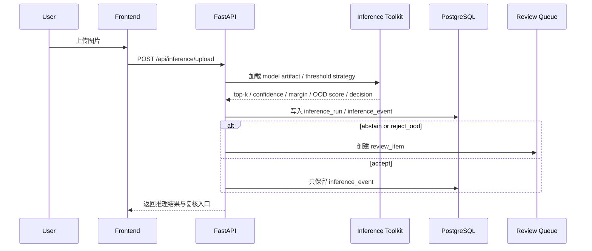
```mermaid
sequenceDiagram
  participant U as User
  participant FE as Frontend
  participant API as FastAPI
  participant ML as Inference Toolkit
  participant DB as PostgreSQL
  participant RV as Review Queue

  U->>FE: 上传图片
  FE->>API: POST /api/inference/upload
  API->>ML: 加载 model artifact / threshold strategy
  ML-->>API: top-k / confidence / margin / OOD score / decision
  API->>DB: 写入 inference_run / inference_event
  alt abstain or reject_ood
    API->>RV: 创建 review_item
  else accept
    API->>DB: 只保留 inference_event
  end
  API-->>FE: 返回推理结果与复核入口
```

批量文件夹推理流程：

```text
folder upload
-> 创建 inference_run
-> 遍历图片
-> 每张生成 inference_event
-> route_all_to_review 或按 decision 创建 review_item
-> 前端显示 batch summary
-> 复核队列按 inference_run / dataset version 追踪
```

### 3.11 推理决策规则

推理结果不会只返回 top-1，而是返回一组证据：

- `top_k`
- `confidence`
- `margin`
- `ood_score`
- `nearest_neighbors`
- `decision`
- `decision_reasons`

决策规则：

```python
if ood_score > tau_ood:
    decision = "reject_ood"
elif confidence < tau_conf:
    decision = "abstain"
elif margin < tau_margin:
    decision = "abstain"
else:
    decision = "accept"
```

指标含义：

| 指标 | 中文解释 |
|---|---|
| confidence | 模型对 top-1 类别的校准后置信度 |
| margin | top-1 与 top-2 的分数差，越小说明越容易混淆 |
| OOD score | 样本偏离当前数据集分布的程度，越大越像分布外 |
| accept | 系统自动接受预测 |
| abstain | 模型不够确定，交给人工 |
| reject_ood | 疑似不属于当前数据集类别空间，交给人工确认 |

### 3.12 LLM 能力设计

LLM 在 FineVision 中不是自动标注器，而是复核辅助员。

可用任务：

| task | 用途 |
|---|---|
| `inference_explanation` | 解释推理结果为什么 accept / abstain / reject_ood |
| `review_assistance` | 辅助人工复核一张图片 |
| `training_diagnosis` | 根据训练状态和错误给出排障建议 |
| `feedback_curation` | 根据反馈池给出数据策展建议 |
| `dataset_card_generation` | 根据类别标签生成数据集摘要 |

LLM 输入上下文：

- 图片像素或图片引用。
- dataset summary。
- class preview。
- top-k 结果。
- confidence / margin / OOD score。
- decision reason。
- nearest-neighbor evidence。
- prior holistic analysis。

### 3.13 LLM 提示词设计

核心 system-style 约束：

```text
你是 FineVision 的 LLM Assistant，只能提供 advisory-only 建议，
不能替代人工标签，不能调整生产阈值，不能把反馈直接写回训练集。
请用中文填写结构化字段；这些字段会被 JSON Schema 严格约束。
```

视觉复核权重设计：

```text
当收到真实图像像素时：
  图像像素权重约 70%
  文件名 / 数据集摘要权重约 15%
  视觉模型 top-k / 置信度 / 近邻证据权重约 15%

模型 top-1 只能作为辅助，不能压过清晰可见的图像内容。
```

OOD 约束：

```text
如果可见内容不在 dataset_summary.class_preview 或数据集摘要描述范围内，
label 写 OOD 或 uncertain。
不要为了迎合模型输出而发明新类别。
```

为什么这样设计：

- 避免 LLM 被模型 top-1 带偏。
- 让人工复核仍以图像内容为主。
- 防止 LLM 自动把分布外样本强行归入已有类别。
- 保持 LLM 建议和平台闭环的边界清晰。

### 3.14 LLM 结构化输出

LLM 使用 JSON Schema / structured outputs 约束输出。

输出字段：

```json
{
  "summary": "给操作员的一句话摘要",
  "holistic_analysis": "综合图像、数据集、模型证据的初步判断",
  "final_category_suggestion": {
    "label": "建议类别 / OOD / uncertain",
    "rationale": "建议理由"
  },
  "inspection_notes": ["人工应检查的视觉线索"],
  "suggested_actions": ["安全下一步动作"],
  "risk_flags": ["风险提示"],
  "confidence": "low | medium | high"
}
```

为什么不用纯自然语言：

- 前端可以稳定渲染不同区域。
- 可以单独展示“最后类别建议”。
- 可以校验字段是否缺失。
- 可以避免 LLM 输出 Markdown 或跑题。
- 后续可以把字段用于审计，但不用于自动标注。

### 3.15 LLM 容错设计

当前 LLM 调用支持：

- `responses` API。
- `chat_completions` fallback。
- primary model + fallback models。
- 图片输入失败时降级为文本上下文。
- structured output 校验。
- `disable_response_storage=true`，减少供应商侧存储风险。

配置示例：

```env
FINEVISION_LLM_PROVIDER=OpenAI
FINEVISION_LLM_MODEL=gpt-5.5
FINEVISION_LLM_REVIEW_MODEL=gpt-5.5
FINEVISION_LLM_REASONING_EFFORT=high
FINEVISION_LLM_WIRE_API=responses
FINEVISION_LLM_STRUCTURED_OUTPUTS=true
FINEVISION_LLM_DISABLE_RESPONSE_STORAGE=true
FINEVISION_LLM_FALLBACK_MODELS=qwen-plus
```

### 3.16 风险约束阈值策略

FineVision 当前采用第一阶段在线可弃权方案：风险约束阈值策略。

它的目标不是“准确率最高”，而是：

```text
在自动接受错误率不超过目标风险的前提下，
尽可能提高自动处理覆盖率，
尽可能降低人工复核成本。
```

形式化目标：

```text
给定目标风险 r_target

在所有候选阈值 tau_conf, tau_margin, tau_ood 中搜索：

maximize   auto_coverage(tau)
subject to selective_risk(tau) <= r_target
```

其中：

```text
selective_risk = accepted_errors / accepted_count
accept_coverage = accepted_count / total_count
auto_coverage = (accepted_count + rejected_ood_count) / total_count
review_rate = review_count / total_count
```

阈值含义：

| 阈值 | 作用 |
|---|---|
| `tau_conf` | 最低置信度，低于它就 abstain |
| `tau_margin` | 最低 top1-top2 差距，低于它说明类别混淆 |
| `tau_ood` | OOD score 上限，高于它就 reject_ood |

### 3.17 阈值如何更新

阈值不是 LLM 调出来的，也不是手写拍脑袋。

更新来源：

1. 已有 inference event。
2. 人工复核后的 feedback item。
3. replay benchmark 中带真值的样本。

搜索方式：

```text
1. 从样本分数中取候选 tau_conf。
2. 从 margin 分布中取候选 tau_margin。
3. 从 OOD score 分布中取候选 tau_ood。
4. 枚举候选组合。
5. 对每组阈值回放历史样本。
6. 计算 selective risk、coverage、review cost、OOD recall。
7. 过滤掉超过目标风险的组合。
8. 在剩余组合中选 auto coverage 最高的。
```

策略生命周期：

```text
feedback samples
-> propose policy
-> status = shadow
-> 回放已有 inference events
-> 记录 abstention_shadow_decisions
-> 用户查看指标
-> 用户填写激活理由
-> status = active
```

激活保护：

- 需要人工填写 activation reason。
- 同一 dataset version + model version 只能有一个 active policy。
- 新策略激活后，旧 active policy 会变成 superseded。
- 反馈样本不足时不能激活。

### 3.18 为什么这属于在线可弃权

“可弃权”指模型可以选择不自动给出最终类别，而是把样本交给人工或 OOD 流程。

FineVision 的策略属于在线可弃权的工程化第一阶段：

- 每次推理都用当前 active policy 做 accept / abstain / reject_ood。
- 新反馈不断积累。
- 用户可以基于新增反馈重新 propose policy。
- 新策略 shadow 验证后再人工激活。

它不是 bandit/regret-minimization 那类复杂在线学习算法，但已经具备在线更新策略的闭环。

### 3.19 实现边界

当前不做：

- LLM 自动打标签。
- LLM 自动调阈值。
- 复核结果直接写回训练集。
- 自动发布生产模型。
- LoRA / full fine-tune。
- 多租户权限系统。

当前重点是：

```text
CLS 训练链路稳定
推理-复核-反馈闭环稳定
阈值策略可解释、可量化、可回放
```

## 4. 评估测试报告

### 4.1 实验目标

评估 FineVision 的风险约束 selective classification / OOD rejection 策略是否有实际价值。

核心问题：

```text
系统能不能在控制自动错误率的同时，
尽可能多地自动处理样本，
并把明显 OOD 样本拒绝掉？
```

### 4.2 实验设置

数据集：

- ID 数据：CIFAR-100 test，1000 张 balanced samples。
- OOD 数据：SVHN test，1000 张 samples。

模型：

- ViT-S：`dinov3_vits16`
- ViT-L：`dinov3_vitl16`

策略：

- raw model：不弃权，不拒绝 OOD。
- saved thresholds：训练产物中已有阈值。
- confidence + margin：只做选择性分类。
- confidence + margin + OOD：同时做选择性分类和 OOD rejection。

风险目标：

- 1% target risk：保守策略，自动处理质量更高。
- 5% target risk：更激进，人工复核成本更低。

### 4.3 指标解释

| 指标 | 含义 | 方向 |
|---|---|---|
| Raw accuracy | 不弃权时的整体准确率 | 越高越好 |
| Accepted accuracy | 自动接受样本中的准确率 | 越高越好 |
| Selective risk | 自动接受样本中的错误率 | 越低越好 |
| Accept coverage | 被接受为正常分类的比例 | 结合风险看 |
| Auto coverage | accept + reject_ood 的自动处理比例 | 越高越好 |
| Review rate | 进入人工复核的比例 | 越低越好 |
| OOD recall | OOD 样本被成功拒绝的比例 | 越高越好 |
| OOD accept rate | OOD 被误当正常类别接受的比例 | 越低越好 |

### 4.4 ID-only 结果

| Model | Target risk | Raw accuracy | Best accepted accuracy | Selective risk | Coverage | Review rate |
|---|---:|---:|---:|---:|---:|---:|
| ViT-S | 1% | 87.80% | 99.17% | 0.83% | 60.00% | 40.00% |
| ViT-S | 5% | 87.80% | 95.00% | 5.00% | 82.00% | 18.00% |
| ViT-L | 1% | 93.10% | 99.08% | 0.92% | 76.00% | 24.00% |
| ViT-L | 5% | 93.10% | 95.21% | 4.79% | 96.00% | 4.00% |

结论：

- ViT-L 明显强于 ViT-S。
- 在 1% 风险目标下，ViT-L 仍能自动接受 76% 样本。
- 在 5% 风险目标下，ViT-L 自动接受 96% 样本，人工复核率降至 4%。

### 4.5 CIFAR-100 + SVHN OOD 结果

| Model | Target risk | Best policy | Accepted accuracy | Selective risk | Auto coverage | Review rate | OOD recall | OOD accept rate |
|---|---:|---|---:|---:|---:|---:|---:|---:|
| ViT-S | 1% | conf + margin + OOD | 99.15% | 0.85% | 79.60% | 20.40% | 100.00% | 0.00% |
| ViT-S | 5% | conf + margin + OOD | 95.00% | 5.00% | 91.00% | 9.00% | 100.00% | 0.00% |
| ViT-L | 1% | conf + margin + OOD | 99.30% | 0.70% | 87.45% | 12.55% | 100.00% | 0.00% |
| ViT-L | 5% | conf + margin + OOD | 95.03% | 4.97% | 98.30% | 1.70% | 100.00% | 0.00% |

结论：

- OOD-aware policy 比只看 confidence/margin 更完整。
- ViT-L 在 1% 风险目标下达到 87.45% 自动处理率，OOD recall 100%，OOD accept rate 0%。
- ViT-L 在 5% 风险目标下达到 98.30% 自动处理率，人工复核率只有 1.70%。
- 这说明阈值策略不是为了堆模块，而是能量化降低人工成本，同时控制自动决策风险。

### 4.6 项目亮点总结

```text
实现并评估了一个风险约束 selective classification / OOD rejection 策略。
基于 CIFAR-100 + SVHN 构建自动化 benchmark，量化 selective risk、auto coverage、
OOD recall、OOD accept rate 和人工复核成本。DINOv3 ViT-L 在 1% 风险目标下达到
87.45% 自动处理率、100% OOD recall 和 0% OOD accept rate；在 5% 风险目标下达到
98.30% 自动处理率，人工复核率降至 1.70%。
```

## 5. 附录：工程参考手册 {#appendix-reference}

本附录用于展示和技术追问。主体文档讲“为什么”和“怎么用”，附录讲“系统具体有哪些接口、表、页面和容器”。

### 5.1 API 总览

所有业务接口统一挂在 FastAPI `api` 服务下，本地默认地址：

```text
http://localhost:8001
```

接口分组：

| 分组 | 作用 |
|---|---|
| Health | 服务健康检查 |
| Dataset | 数据集导入、详情、样本预览、dataset card |
| Job | 后台任务创建、列表、取消 |
| Training | 训练任务创建、暂停、恢复、取消、删除 |
| Weights | DINOv3 权重缓存查看和删除 |
| Inference | 单图、路径、文件夹推理 |
| Review | 人工复核队列、详情、提交、LLM 辅助 |
| Feedback | 反馈池查询 |
| LLM | 通用 LLM 辅助 |
| Abstention Policy | 风险阈值策略提议、查看、激活、停用、shadow 决策 |

### 5.2 Health API

| Method | Path | 作用 | 主要返回 |
|---|---|---|---|
| GET | `/api/health` | 健康检查 | `{status: "ok"}` |

### 5.3 Dataset API

| Method | Path | 作用 | 关键参数 | 主要副作用 |
|---|---|---|---|---|
| GET | `/api/datasets` | 获取数据集列表 | 无 | 无 |
| GET | `/api/datasets/{dataset_id}` | 获取数据集详情 | `dataset_id` | 无 |
| POST | `/api/datasets/import-imagefolder` | 从容器可访问路径导入 ImageFolder | `path`, `dataset_id`, `dataset_version_id` | 创建 dataset / dataset_version / manifest artifact |
| POST | `/api/datasets/upload-imagefolder` | 上传本地文件夹导入 ImageFolder | multipart files, `dataset_id` | 校验图片、复制到 imported datasets、创建 manifest |
| GET | `/api/dataset-versions/{dataset_version_id}/readiness` | 查看数据集准备度 | `dataset_version_id` | 无 |
| GET | `/api/dataset-versions/{dataset_version_id}/sample-previews` | 获取样本预览 | `limit` | 无 |
| GET | `/api/dataset-versions/{dataset_version_id}/samples/{sample_id}/image` | 读取样本图片 | `sample_id` | 无 |
| GET | `/api/dataset-versions/{dataset_version_id}/card` | 获取 dataset card | `dataset_version_id` | 无 |
| PUT | `/api/dataset-versions/{dataset_version_id}/card` | 编辑 dataset card | `task`, `domain`, `summary`, `known_confusions`, `ood_policy`, `review_guidance` | 更新 dataset card artifact |
| POST | `/api/dataset-versions/{dataset_version_id}/card/generate` | 用 LLM 生成 dataset card | `dataset_version_id` | 更新 dataset card artifact |

Dataset API 设计要点：

- 训练、推理、复核都绑定 `dataset_version_id`，不是只绑定 `dataset_id`。
- `dataset card` 是可编辑上下文，不是训练标签。
- 上传导入会把本地图片复制到项目托管目录，后续容器可稳定访问。

### 5.4 Job API

| Method | Path | 作用 | 关键参数 | 主要副作用 |
|---|---|---|---|---|
| POST | `/api/jobs` | 创建后台 job | `job_type`, `payload`, `priority` | 写入 `jobs` |
| GET | `/api/jobs` | 获取 job 列表 | 可按状态过滤 | 无 |
| GET | `/api/jobs/{job_id}` | 获取 job 详情 | `job_id` | 无 |
| POST | `/api/jobs/{job_id}/cancel` | 取消 job | `job_id` | job 状态变为 cancelled |

Job 状态：

```text
queued -> running -> succeeded
queued/running -> failed
queued/running -> cancelled
running -> paused -> queued/running
```

### 5.5 Training API

| Method | Path | 作用 | 关键参数 | 主要副作用 |
|---|---|---|---|---|
| POST | `/api/training-runs` | 创建训练任务 | `dataset_version_id`, `backbone_id`, `extractor_config`, `head_config` | 创建 job 和 training_run |
| GET | `/api/training-runs` | 获取训练队列 | status / dataset filter | 无 |
| GET | `/api/training-runs/{run_id}` | 获取训练详情 | `run_id` | 无 |
| POST | `/api/training-runs/{run_id}/pause` | 暂停训练任务 | `run_id` | job / run 标记 paused |
| POST | `/api/training-runs/{run_id}/resume` | 恢复训练任务 | `run_id` | job / run 回到 queued |
| POST | `/api/training-runs/{run_id}/cancel` | 取消训练任务 | `run_id` | job / run 标记 cancelled |
| DELETE | `/api/training-runs/{run_id}` | 删除训练记录 | `run_id` | 删除 run 记录，保留或清理策略按实现处理 |

训练任务创建后，真正计算由 `ml-worker` 执行。API 只负责创建任务、记录状态和返回详情。

### 5.6 Model Weight API

| Method | Path | 作用 | 关键参数 | 主要副作用 |
|---|---|---|---|---|
| GET | `/api/model-weights` | 查看 DINOv3 权重缓存 | 无 | 无 |
| DELETE | `/api/model-weights/{preset}` | 删除某个权重缓存 | `preset`，如 `dinov3_vits` | 删除对应缓存文件 |

权重 API 用于解释训练为什么快或慢：如果权重已经在 HuggingFace / Torch cache 中，训练时不需要重复下载。

### 5.7 Inference API

| Method | Path | 作用 | 关键参数 | 主要副作用 |
|---|---|---|---|---|
| POST | `/api/inference` | 使用样本 ID 或容器路径推理 | `dataset_version_id`, `model_version_id`, `sample_id` / `image_path`, `top_k`, thresholds | 写入 inference_run / inference_event，必要时创建 review_item |
| POST | `/api/inference/upload` | 上传单张图片推理 | multipart image, `dataset_version_id`, `model_version_id`, `top_k` | 保存上传图片、写 inference_event、可创建 review_item |
| POST | `/api/inference/upload-folder` | 上传文件夹批量推理 | multipart files, `dataset_version_id`, `model_version_id`, `route_all_to_review` | 创建 batch inference_run，多条 inference_event，多条 review_item |

推理请求可以覆盖阈值：

| 参数 | 作用 |
|---|---|
| `accept_threshold` | 临时覆盖 `tau_conf` |
| `margin_threshold` | 临时覆盖 `tau_margin` |
| `ood_distance_threshold` | 临时覆盖 `tau_ood` |
| `route_all_to_review` | 文件夹推理时是否全部进入复核 |

### 5.8 Review API

| Method | Path | 作用 | 关键参数 | 主要副作用 |
|---|---|---|---|---|
| GET | `/api/review-items` | 获取复核队列 | `status`, `dataset_id`, `limit`, `offset` | 无 |
| GET | `/api/review-items/{review_item_id}` | 获取复核详情 | `review_item_id` | 无 |
| POST | `/api/review-items/{review_item_id}/submit` | 提交人工复核结论 | `final_outcome`, `final_label`, `reviewer_note` | 更新 review_item，创建 feedback_item |
| POST | `/api/review-items/{review_item_id}/assist` | 为复核项生成 LLM 辅助 | `review_item_id` | 更新 `assistance_metadata` |

Review 状态：

| 状态 | 含义 |
|---|---|
| `pending` | 待复核 |
| `submitted` | 已提交人工结论 |
| `feedbacked` | 已写入反馈池 |
| `skipped` | 跳过 |
| `disputed` | 有争议 |

### 5.9 Feedback API

| Method | Path | 作用 | 关键参数 | 主要返回 |
|---|---|---|---|---|
| GET | `/api/feedback-items` | 查询反馈池 | `destination`, `dataset_id`, `limit` | feedback item 列表 |

Feedback destination：

| destination | 含义 |
|---|---|
| `training_candidate` | 可作为下一轮数据集候选 |
| `ood_stress` | OOD 压力测试候选 |
| `bad_image` | 坏图池 |
| `taxonomy_dispute` | 类别争议池 |
| `ignore` | 忽略池 |

### 5.10 LLM API

| Method | Path | 作用 | 关键参数 | 主要返回 |
|---|---|---|---|---|
| POST | `/api/llm/assist` | 通用 LLM 辅助 | `task`, `context` | structured assistance |

支持任务：

| task | 用途 |
|---|---|
| `inference_explanation` | 解释推理结果 |
| `review_assistance` | 辅助人工复核 |
| `training_diagnosis` | 训练排障 |
| `feedback_curation` | 反馈池策展建议 |

LLM 返回字段：

| 字段 | 含义 |
|---|---|
| `summary` | 一句话摘要 |
| `holistic_analysis` | 综合分析 |
| `final_category_suggestion.label` | 最后类别建议 |
| `final_category_suggestion.rationale` | 类别建议理由 |
| `inspection_notes` | 人工检查点 |
| `suggested_actions` | 建议动作 |
| `risk_flags` | 风险提示 |
| `confidence` | LLM 对建议的自评置信度 |

### 5.11 Abstention Policy API

| Method | Path | 作用 | 关键参数 | 主要副作用 |
|---|---|---|---|---|
| POST | `/api/abstention-policies/propose` | 基于反馈样本提议阈值策略 | `dataset_version_id`, `model_version_id`, `target_selective_risk` | 创建 shadow policy |
| GET | `/api/abstention-policies` | 查询策略列表 | `dataset_version_id`, `model_version_id`, `status` | 无 |
| GET | `/api/abstention-policies/{policy_id}` | 查看策略详情 | `policy_id` | 无 |
| POST | `/api/abstention-policies/{policy_id}/activate` | 激活策略 | `activation_reason`, `activated_by` | 当前策略变 active，旧策略 superseded |
| POST | `/api/abstention-policies/{policy_id}/deactivate` | 停用策略 | `deactivation_reason` | 策略变 deactivated |
| GET | `/api/abstention-policies/{policy_id}/shadow-decisions` | 查看 shadow 决策 | `policy_id`, `limit` | 无 |

策略字段：

| 字段 | 含义 |
|---|---|
| `target_selective_risk` | 目标自动接受错误率 |
| `tau_conf` | 置信度阈值 |
| `tau_margin` | top1-top2 间隔阈值 |
| `tau_ood` | OOD 阈值 |
| `source_feedback_count` | 用于搜索阈值的反馈样本数 |
| `metrics` | replay 后的风险、覆盖率、复核率等指标 |
| `selection_config` | 阈值搜索配置 |

### 5.12 数据库表总览

| 表 | 主要职责 |
|---|---|
| `datasets` | 数据集业务实体 |
| `dataset_versions` | 不可变数据集版本 |
| `artifacts` | 文件产物注册表 |
| `jobs` | 后台任务状态 |
| `job_events` | 后台任务事件日志 |
| `training_runs` | 训练运行记录 |
| `model_versions` | 候选模型版本 |
| `inference_runs` | 一批推理记录 |
| `inference_events` | 单个样本推理记录 |
| `review_items` | 人工复核项 |
| `feedback_items` | 复核后的反馈池 |
| `abstention_policy_versions` | 风险阈值策略版本 |
| `abstention_shadow_decisions` | shadow 策略回放结果 |

### 5.13 `datasets` 字段说明

| 字段 | 类型 | 说明 |
|---|---|---|
| `id` | UUID | 主键 |
| `dataset_key` | text | 业务可读 id，唯一 |
| `name` | text | 数据集名称 |
| `description` | text | 描述 |
| `domain` | text | 领域，例如 birds、cifar、plant disease |
| `status` | text | `draft` / `ready` / `archived` |
| `created_at` | timestamptz | 创建时间 |
| `updated_at` | timestamptz | 更新时间 |

### 5.14 `dataset_versions` 字段说明

| 字段 | 类型 | 说明 |
|---|---|---|
| `id` | UUID | 主键 |
| `dataset_id` | UUID | 所属 dataset |
| `version_key` | text | 数据集版本业务 id，唯一 |
| `root_uri` | text | 数据集版本根路径 |
| `sample_count` | integer | 样本数 |
| `class_count` | integer | 类别数 |
| `split_summary` | JSONB | train/val/test 分布 |
| `readiness_status` | text | 数据准备状态 |
| `readiness_report` | JSONB | 准备度报告 |
| `manifest_artifact_id` | UUID | manifest artifact |
| `created_by_job_id` | UUID | 创建它的 job |
| `created_at` | timestamptz | 创建时间 |

### 5.15 `artifacts` 字段说明

| 字段 | 类型 | 说明 |
|---|---|---|
| `id` | UUID | 主键 |
| `artifact_key` | text | 业务可读 artifact id |
| `artifact_type` | text | manifest、feature、model、report 等 |
| `dataset_id` | UUID | 关联数据集 |
| `dataset_version_id` | UUID | 关联数据集版本 |
| `job_id` | UUID | 产出该 artifact 的 job |
| `uri` | text | 文件路径或对象存储 URI |
| `checksum` | text | 校验和 |
| `content_type` | text | 文件类型 |
| `size_bytes` | bigint | 文件大小 |
| `artifact_metadata` | JSONB | 结构化元数据 |
| `created_at` | timestamptz | 创建时间 |

### 5.16 `jobs` 与 `job_events` 字段说明

`jobs`：

| 字段 | 类型 | 说明 |
|---|---|---|
| `id` | UUID | 主键 |
| `job_key` | text | 业务 id，唯一 |
| `job_type` | text | 任务类型，如 import、train |
| `status` | text | `queued` / `paused` / `running` / `succeeded` / `failed` / `cancelled` |
| `payload` | JSONB | 任务输入 |
| `result` | JSONB | 任务结果 |
| `error_message` | text | 错误信息 |
| `priority` | integer | 优先级 |
| `attempt_count` | integer | 已尝试次数 |
| `max_attempts` | integer | 最大重试次数 |
| `lease_owner` | text | 当前 worker |
| `lease_expires_at` | timestamptz | 租约过期时间 |
| `created_at` / `queued_at` / `started_at` / `finished_at` / `updated_at` | timestamptz | 生命周期时间 |

`job_events`：

| 字段 | 类型 | 说明 |
|---|---|---|
| `id` | UUID | 主键 |
| `job_id` | UUID | 所属 job |
| `event_type` | text | 事件类型 |
| `message` | text | 可读消息 |
| `payload` | JSONB | 事件细节 |
| `created_at` | timestamptz | 事件时间 |

### 5.17 `training_runs` 字段说明

| 字段 | 类型 | 说明 |
|---|---|---|
| `id` | UUID | 主键 |
| `run_key` | text | 训练 run 业务 id |
| `job_id` | UUID | 对应后台 job |
| `dataset_id` | UUID | 数据集 |
| `dataset_version_id` | UUID | 数据集版本 |
| `status` | text | `queued` / `paused` / `running` / `succeeded` / `failed` / `cancelled` |
| `backbone_id` | text | DINOv3 preset |
| `extractor_config` | JSONB | 特征提取配置 |
| `head_config` | JSONB | 分类头配置 |
| `feature_artifact_id` | UUID | 特征 artifact |
| `model_artifact_id` | UUID | 模型 artifact |
| `report_artifact_id` | UUID | 训练报告 |
| `calibration_artifact_id` | UUID | 校准报告 |
| `threshold_strategy_artifact_id` | UUID | 阈值策略 artifact |
| `metrics` | JSONB | accuracy、F1、risk 等 |
| `error_message` | text | 失败原因 |
| `created_at` / `started_at` / `finished_at` / `updated_at` | timestamptz | 生命周期时间 |

### 5.18 `model_versions` 字段说明

| 字段 | 类型 | 说明 |
|---|---|---|
| `id` | UUID | 主键 |
| `model_key` | text | 模型版本业务 id |
| `dataset_id` | UUID | 数据集 |
| `dataset_version_id` | UUID | 数据集版本 |
| `training_run_id` | UUID | 来源训练 run |
| `status` | text | `candidate` / `staging` / `production` / `archived` / `failed` |
| `model_artifact_id` | UUID | 模型权重 artifact |
| `calibration_artifact_id` | UUID | 校准 artifact |
| `threshold_strategy_artifact_id` | UUID | 阈值策略 artifact |
| `metrics` | JSONB | 模型指标 |
| `created_at` / `updated_at` | timestamptz | 时间 |

当前 MVP 主要使用 `candidate`，不强调 production 发布。

### 5.19 `inference_runs` 与 `inference_events` 字段说明

`inference_runs`：

| 字段 | 类型 | 说明 |
|---|---|---|
| `id` | UUID | 主键 |
| `run_key` | text | 推理批次业务 id |
| `dataset_id` | UUID | 数据集 |
| `dataset_version_id` | UUID | 数据集版本 |
| `model_version_id` | UUID | 模型版本 |
| `run_type` | text | `single` / `upload` / `upload_folder` |
| `status` | text | `running` / `succeeded` / `partial_failed` / `failed` |
| `item_count` | integer | 推理图片数 |
| `review_item_count` | integer | 进入复核数 |
| `applied_policy_key` | text | 应用的策略 id |
| `applied_policy_source` | text | 策略来源 |
| `threshold_snapshot` | JSONB | 推理时阈值快照 |
| `request_payload` | JSONB | 请求参数 |
| `summary` | JSONB | 批次摘要 |
| `created_at` / `updated_at` / `finished_at` | timestamptz | 时间 |

`inference_events`：

| 字段 | 类型 | 说明 |
|---|---|---|
| `id` | UUID | 主键 |
| `event_key` | text | 单样本推理事件 id |
| `inference_run_id` | UUID | 所属批次 |
| `dataset_id` / `dataset_version_id` / `model_version_id` | UUID | 推理作用域 |
| `model_status` | text | 模型状态 |
| `model_artifact_id` | UUID | 模型 artifact |
| `feature_artifact_id` | UUID | 特征 artifact |
| `threshold_strategy_artifact_id` | UUID | 阈值策略 artifact |
| `input_type` | text | `sample` / `image_path` / `upload` |
| `input_ref` | text | 输入图片路径或引用 |
| `sample_id` | text | 数据集样本 id |
| `decision` | text | `accept` / `abstain` / `reject_ood` |
| `confidence` | float | 置信度 |
| `margin` | float | top1-top2 margin |
| `ood_score` | float | OOD 分数 |
| `reasons` | JSONB | 决策原因 |
| `request_payload` | JSONB | 请求快照 |
| `result_payload` | JSONB | 推理结果快照 |
| `created_at` | timestamptz | 创建时间 |

### 5.20 `review_items` 与 `feedback_items` 字段说明

`review_items`：

| 字段 | 类型 | 说明 |
|---|---|---|
| `id` | UUID | 主键 |
| `review_key` | text | 复核项业务 id |
| `inference_event_id` | UUID | 来源推理事件，唯一 |
| `inference_run_id` | UUID | 来源推理批次 |
| `dataset_id` / `dataset_version_id` / `model_version_id` | UUID | 作用域 |
| `sample_id` | text | 样本 id |
| `input_ref` | text | 图片引用 |
| `status` | text | `pending` / `submitted` / `feedbacked` / `skipped` / `disputed` |
| `risk_type` | text | `low_confidence` / `low_margin` / `ood_candidate` / `mixed` |
| `priority` | integer | 复核优先级 |
| `reason` | text | 可读复核原因 |
| `reason_codes` | JSONB | 机器可读原因 |
| `context` | JSONB | top-k、阈值、近邻、图像等上下文 |
| `assistance_metadata` | JSONB | LLM 辅助结果 |
| `assigned_to` | text | 分配给谁 |
| `submitted_at` / `feedbacked_at` | timestamptz | 提交和反馈时间 |
| `completed_by` | text | 完成人 |
| `created_at` / `updated_at` | timestamptz | 时间 |

`feedback_items`：

| 字段 | 类型 | 说明 |
|---|---|---|
| `id` | UUID | 主键 |
| `feedback_key` | text | 反馈业务 id |
| `review_item_id` | UUID | 来源复核项，唯一 |
| `inference_event_id` | UUID | 来源推理事件 |
| `inference_run_id` | UUID | 来源推理批次 |
| `dataset_id` / `dataset_version_id` / `model_version_id` | UUID | 作用域 |
| `sample_id` | text | 样本 id |
| `final_label` | text | 人工最终类别 |
| `final_outcome` | text | `confirmed_label` / `corrected_label` / `ood` / `bad_image` / `uncertain` / `ignore` |
| `destination` | text | `training_candidate` / `ood_stress` / `bad_image` / `taxonomy_dispute` / `ignore` |
| `reviewer_note` | text | 复核备注 |
| `feedback_metadata` | JSONB | 反馈上下文 |
| `created_by` | text | 创建人 |
| `created_at` | timestamptz | 创建时间 |

### 5.21 `abstention_policy_versions` 与 `abstention_shadow_decisions` 字段说明

`abstention_policy_versions`：

| 字段 | 类型 | 说明 |
|---|---|---|
| `id` | UUID | 主键 |
| `policy_key` | text | 策略业务 id |
| `dataset_id` / `dataset_version_id` / `model_version_id` | UUID | 策略作用域 |
| `status` | text | `shadow` / `candidate` / `active` / `superseded` / `deactivated` / `archived` |
| `target_selective_risk` | float | 目标 selective risk |
| `tau_conf` | float | 置信度阈值 |
| `tau_margin` | float | margin 阈值 |
| `tau_ood` | float | OOD 阈值 |
| `source_feedback_count` | integer | 来源反馈样本数 |
| `metrics` | JSONB | 策略指标 |
| `selection_config` | JSONB | 搜索配置 |
| `created_by` | text | 创建人 |
| `activated_by` / `activation_reason` / `activated_at` | text/timestamptz | 激活信息 |
| `deactivated_by` / `deactivation_reason` / `deactivated_at` | text/timestamptz | 停用信息 |
| `created_at` / `updated_at` | timestamptz | 时间 |

`abstention_shadow_decisions`：

| 字段 | 类型 | 说明 |
|---|---|---|
| `id` | UUID | 主键 |
| `policy_version_id` | UUID | 策略版本 |
| `inference_event_id` | UUID | 回放的推理事件 |
| `current_decision` | text | 当前策略决策 |
| `shadow_decision` | text | shadow 策略决策 |
| `decision_diff` | text | 决策差异类型 |
| `score_snapshot` | JSONB | 回放时分数快照 |
| `created_at` | timestamptz | 创建时间 |

### 5.22 前端页面路由参考

| 路由 | 页面组件 | 标题 | 面包屑 |
|---|---|---|---|
| `/` | `DashboardPage` | 今日工作台 | 首页 / 工作台 |
| `/dashboard` | redirect `/` | 今日工作台 | 首页 / 工作台 |
| `/datasets` | `DatasetsPage` | 数据集 | 数据资产 |
| `/datasets/:datasetId` | `DatasetDetailPage` | 数据集详情 | 数据集 / 版本详情 |
| `/training` | `TrainingPage` | 训练任务 | 训练 |
| `/training/:runId` | `TrainingDetailPage` | 训练详情 | 训练 / 运行详情 |
| `/inference` | `InferencePage` | 推理实验室 | 推理 |
| `/weights` | `WeightManagementPage` | 权重管理 | 模型权重 |
| `/review` | `ReviewPage` | 人工复核 | 复核队列 |
| `/review/:reviewItemId` | `ReviewDetailPage` | 复核详情 | 复核 / 样本详情 |
| `/feedback` | `FeedbackPage` | 反馈池 | 复核 / 反馈池 |
| `/models` | `ModelsPage` | 模型版本 | 模型注册表 |
| `/models/:modelId` | `ModelDetailPage` | 模型详情 | 模型 / 版本详情 |
| `/pipelines` | `PipelinesPage` | 流水线 | 编排 |
| `/pipelines/:pipelineRunId` | `PipelineRunPage` | 流水线运行 | 流水线 / 运行详情 |

Legacy query 兼容：

| 旧入口 | 新路由 |
|---|---|
| `?page=dashboard` | `/` |
| `?page=datasets` | `/datasets` |
| `?page=training` | `/training` |
| `?page=inference` | `/inference` |
| `?page=review` | `/review` |
| `?page=feedback` | `/feedback` |
| `?page=models` | `/models` |
| `?page=pipelines` | `/pipelines` |

### 5.23 Docker 容器职责

| 容器 | 镜像 / Dockerfile | 端口 | 是否需要 GPU | 职责 |
|---|---|---:|---|---|
| `frontend` | `frontend/Dockerfile` | `5173:5173` | 否 | React/Vite 前端，代理 API |
| `api` | `Dockerfile.api` | `8001:8000` | 可用 GPU | FastAPI 控制平面，提供所有 `/api/*` |
| `ml-worker` | `Dockerfile.worker` | 无 HTTP 端口 | 是 | 后台任务，数据导入、特征提取、训练、校准 |
| `migrate` | `Dockerfile.migrate` | 无 | 否 | 启动时执行 `alembic upgrade head` |
| `postgres` | `postgres:16-alpine` | `5432:5432` | 否 | 控制平面数据库 |
| `adminer` | `adminer:4` | `8081:8080` | 否 | 数据库查看工具 |

### 5.24 容器环境变量与挂载

`api` 关键环境变量：

| 变量 | 作用 |
|---|---|
| `DATABASE_URL` | PostgreSQL 连接 |
| `FINEVISION_METADATA_DIR` | 元数据目录 |
| `FINEVISION_ARTIFACT_DIR` | artifact 目录 |
| `FINEVISION_UPLOAD_DIR` | 上传图片目录 |
| `FINEVISION_IMPORTED_DATASET_DIR` | 导入数据集目录 |
| `FINEVISION_DINOV3_DEVICE` | DINOv3 推理设备，当前为 `cuda` |

`ml-worker` 关键环境变量：

| 变量 | 作用 |
|---|---|
| `DATABASE_URL` | PostgreSQL 连接 |
| `FINEVISION_ARTIFACT_DIR` | 写入训练产物 |
| `FINEVISION_IMPORTED_DATASET_DIR` | 读取导入数据 |
| `FINEVISION_DINOV3_DEVICE` | 特征提取设备 |
| `FINEVISION_LINEAR_HEAD_DEVICE` | 分类头训练设备 |

共享 volumes：

| Volume | 作用 |
|---|---|
| `finevision-metadata` | 本地元数据 |
| `finevision-artifacts` | features、model、report 等产物 |
| `finevision-uploads` | 上传推理图片 |
| `finevision-imported-datasets` | 导入后的数据集 |
| `finevision-postgres` | PostgreSQL 数据 |
| `${HOME}/.cache/huggingface` | HuggingFace 权重缓存 |
| `${HOME}/.cache/torch` | Torch 权重缓存 |

### 5.25 容器与 API 的关系

| 容器 | 是否直接对用户提供 API | 包含的接口 |
|---|---|---|
| `frontend` | 是，浏览器页面 | 无后端业务 API；调用 `api` |
| `api` | 是 | 所有 `/api/*`，包括 dataset、training、inference、review、feedback、LLM、policy |
| `ml-worker` | 否 | 不暴露 HTTP API；通过 `jobs` 表消费任务 |
| `migrate` | 否 | 不暴露 API；只做 DB migration |
| `postgres` | 否 | SQL 端口，仅供服务访问 |
| `adminer` | 是，管理 UI | 数据库管理页面，不是业务 API |

### 5.26 端到端数据流参考

数据集导入：

```text
frontend /datasets
-> POST /api/datasets/upload-imagefolder
-> api 校验并复制文件
-> 写 datasets / dataset_versions / artifacts
-> 生成 dataset card
-> 前端展示数据集详情
```

训练：

```text
frontend /training
-> POST /api/training-runs
-> 写 jobs / training_runs
-> ml-worker claim job
-> DINOv3 CLS 特征提取
-> Adam 分类头训练
-> calibration / threshold strategy
-> 写 artifacts / model_versions
-> 前端展示训练详情
```

推理到复核：

```text
frontend /inference
-> POST /api/inference/upload-folder
-> 写 inference_runs
-> 每张图片写 inference_events
-> accept: 只记录事件
-> abstain / reject_ood: 创建 review_items
-> frontend /review 分页复核
```

复核到策略：

```text
review submit
-> POST /api/review-items/{id}/submit
-> 写 feedback_items
-> POST /api/abstention-policies/propose
-> 创建 shadow policy
-> 回放 inference_events 写 shadow decisions
-> 人工查看指标
-> POST /api/abstention-policies/{id}/activate
```
