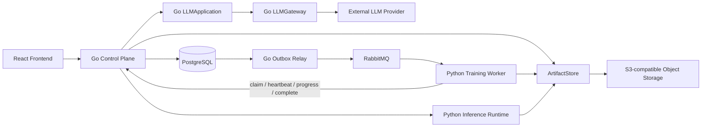

# FineVision 一期重构方案

> 状态：核心实现已落地，按验收清单持续收口
>
> 日期：2026-09-07
>
> 范围：Phase 1
>
> Owner：FineVision maintainers
>
> 实现状态：P1.0–P1.5 已实现；P1.6 Compute Runtime 已实现，剩余公开 route 按 OpenAPI 批次切流
>
> 目标仓库：`FGVCplateformPublic`

本文档既是一期重构基线，也是实施验收账本。Go 控制面、事务型 Outbox/RabbitMQ、ArtifactStore、独立 LLMGateway、Python Compute gRPC、ViT-S Git LFS 发布和 Fine-R1 删除已经落地。未进入当前 OpenAPI 的历史 route 不能继续扩展 Python 实现，必须按这里的所有权逐批迁入 Go。

领域术语以根目录 [`CONTEXT.md`](../CONTEXT.md) 为准；具体框架、工程目录、接口和测试规范见 [`TECHNICAL_ARCHITECTURE.md`](TECHNICAL_ARCHITECTURE.md)。

## 1. 一期目标

一期同时完成以下目标：

1. 使用 Go 重构 FineVision Control Plane，包括公开 HTTP interface、CRUD、业务状态机、事务和任务编排。
2. Python 只保留 Dataset 扫描、特征提取、训练、评估、校准、阈值计算和推理等 Compute Plane implementation。
3. 所有外部大模型调用迁入独立的 Go `LLMGateway` container。
4. 完整删除 Fine-R1 本地视觉复核及自动复核链路。
5. 使用 PostgreSQL transactional outbox 可靠派发训练任务，并由 RabbitMQ 提供竞争消费队列。
6. 使用 S3-compatible ArtifactStore；一期部署采用 MinIO-compatible adapter 保存 Dataset、特征、训练模型和报告。
7. Artifact 发布和加载必须校验 SHA-256 与文件大小。
8. 经许可批准的预训练权重通过 Git LFS 版本化，并同步到运行时 ArtifactStore。
9. 提交一个可公开使用、可重复生成的合成 ImageFolder，贯穿完整 smoke 流程。

### 1.1 实施账本（2026-09-07）

| 阶段 | 状态 | 代码与验证 |
| --- | --- | --- |
| P1.0 范围收缩 | 完成 | Fine-R1 删除测试、12 张合成 ImageFolder |
| P1.1 ArtifactStore | 完成 | Go/Python Local + S3 adapter、真实 MinIO read-back 验证 |
| P1.2 Go 基础 | 完成首批 route | Chi + strict OpenAPI、pgx read model、前端训练合同回归 |
| P1.3 Lifecycle/Outbox | 完成 | 原子创建、attempt/epoch、reaper、幂等 complete、竞态与 PostgreSQL 集成测试 |
| P1.4 RabbitMQ | 完成 | durable topology、prefetch=1、DLQ、persistent confirm、真实 broker 集成测试 |
| P1.5 LLMGateway | 完成 | 独立 Go container、内部 token、advisory allow-list、多模态 transport |
| P1.6 Compute Runtime | Runtime 完成 | Python inference gRPC、verified model bundle；公开推理/review route 继续按 OpenAPI 批次切流 |

## 2. 重构前基线与已修复的 P0

重构前实现存在以下 coupling；保留在这里用于解释本期修复动机：

- [`backend/src/finevision/api/app.py`](../backend/src/finevision/api/app.py) 是接近 2,000 行的单一 FastAPI 入口，同时包含 HTTP、上传、数据库访问、同步推理、LLM 和 Review orchestration。
- Python API、Training Worker 和 VLM Worker 直接共享 PostgreSQL及本地 Docker volume。
- [`backend/src/finevision/api/db_store.py`](../backend/src/finevision/api/db_store.py) 的 Job lease 默认约 300 秒，没有独立 heartbeat；lease 回收依赖下一次 claim 顺带触发。
- [`backend/src/finevision/api/app.py`](../backend/src/finevision/api/app.py) 先创建 Job、再用另一个事务创建 Training Run，可能产生孤儿 Job。
- [`backend/src/finevision/api/training_store.py`](../backend/src/finevision/api/training_store.py) 的 training complete 不校验 Job Attempt fencing，过期 Worker 可能登记迟到模型。
- [`backend/src/finevision/db/schema.py`](../backend/src/finevision/db/schema.py) 已有 Artifact `checksum` 和 `size_bytes`，但运行期尚未写入或校验。
- [`backend/src/finevision/api/inference_store.py`](../backend/src/finevision/api/inference_store.py) 把数据库 URI 直接转换为本地 `Path`，模型和 Feature Artifact 依赖共享 volume。
- Dataset manifest 与 sample path 当前包含本地绝对路径，无法直接替换为 `s3://` URI。
- 当前同步 inference 是 Compute Plane 留在 HTTP handler 的例外，需要迁入常驻 Python Inference Runtime。

一期必须先修复 Job 创建原子性、heartbeat、reaper、fencing、幂等 complete 和 Artifact 完整性，再删除旧 implementation。

## 3. 明确不做的内容

一期不包含：

- 全量微调视觉 backbone。
- 分布式训练或多机训练调度。
- Kafka、Redis、Celery 与 RabbitMQ 并存。
- 真正的训练断点续训；`pause/resume` 仍允许从 pipeline 开头恢复并复用有效特征缓存。
- FAISS、向量数据库或 nearest-neighbor 算法重构。
- Kubernetes、跨区域对象存储和多租户 RBAC。
- 让 LLM 自动提交人工 Review Item、修改最终标签、激活 Abstention Policy 或触发训练。
- 把训练产物、Dataset 或特征矩阵提交到 Git LFS。
- 重写 Git 历史以抹除 Fine-R1；如需执行，必须单独审批并制定强制推送方案。

## 4. 核心架构决策

### 4.1 按所有权拆分，不按 CPU 占用拆分

“低资源操作放 Go、高资源操作放 Python”只作为结果，不作为拆分规则。一期按领域所有权建立 seam：

- Go Control Plane 是业务状态和事务的唯一写入者。
- Python Compute Plane 只读取版本化任务合同、读写对象字节、执行计算并返回结果。
- RabbitMQ 是任务派发 adapter，不是状态事实源。
- PostgreSQL 是 Training Lifecycle、Artifact registry 和 Model Version 的事实源。
- ArtifactStore 是大文件的事实源；数据库不存图片、权重或特征矩阵字节。

### 4.2 目标拓扑



### 4.3 Container 清单

| Container | 语言 | 所有权 | GPU | 数据访问 |
| --- | --- | --- | --- | --- |
| `frontend` | JavaScript | Workbench UI | 否 | 只访问 Go Control Plane |
| `go-control-plane` | Go | 公开 HTTP interface、CRUD、事务、状态机 | 否 | PostgreSQL、ArtifactStore |
| `go-llm-gateway` | Go | 外部大模型 provider adapter | 否 | 外部 LLM；可选 Artifact 只读 |
| `outbox-relay` | Go | 发布已提交的 Outbox Event | 否 | PostgreSQL、RabbitMQ |
| `python-training-worker` | Python | 特征提取、训练、评估、校准、阈值 | 可选/是 | Control Plane、ArtifactStore |
| `python-inference-runtime` | Python | 常驻模型加载、单图推理 | 可选/是 | Control Plane、ArtifactStore |
| `postgres` | - | 业务状态事实源 | 否 | 持久卷 |
| `rabbitmq` | - | 训练任务派发 | 否 | 持久卷 |
| `object-store` | - | Dataset 与 Artifact 对象字节 | 否 | 持久卷 |
| `db-migrate` | Python | 一期唯一数据库迁移执行器 | 否 | PostgreSQL |
| `object-store-init` | 工具容器 | 幂等建桶、版本控制、私有策略 | 否 | ArtifactStore |
| `demo-seed` | 工具容器 | 通过正式 ingest interface 导入示例 Dataset | 否 | Control Plane |

开发 profile 可额外启用 Adminer 和对象存储控制台。

### 4.4 Go 技术栈

一期固定采用“标准库优先、薄框架、显式事务”的 Go 技术栈：

| 能力 | 选型 |
| --- | --- |
| HTTP | `net/http` + `chi/v5` |
| 公开合同 | OpenAPI 3.1 + `oapi-codegen/v2` strict server |
| PostgreSQL | `pgx/v5` + `sqlc` |
| Go/Python interface | Protobuf + gRPC |
| RabbitMQ | `rabbitmq/amqp091-go` |
| ArtifactStore | AWS SDK for Go v2 S3 client behind a storage interface |
| 日志与观测 | `log/slog` + OpenTelemetry + Prometheus |
| 装配 | 手动 constructor wiring |

一期不引入 Gin/Fiber/Echo、GORM、LangChainGo、Redis/Asynq、Go auto-migrate 或全局依赖注入框架。完整选型理由和工程规则见 [`TECHNICAL_ARCHITECTURE.md`](TECHNICAL_ARCHITECTURE.md)；变更这些决定需要 ADR。

## 5. Module 所有权

### 5.1 Go Control Plane

Go Control Plane 负责：

- 保持现有 `/api/*` 路径、snake_case 字段、错误语义和响应 envelope 兼容。
- Dataset、Dataset Version、Training Job、Training Run、Artifact、Model Version、Inference Run、Review Item、Feedback Item 和 Abstention Policy 的 CRUD。
- Dataset 上传会话、预签名 URL、上传完成确认和 ingest job 创建。
- Training Lifecycle 的创建、claim、heartbeat、progress、pause、resume、cancel、retry、complete 和 fail。
- Artifact registry 和 Model Version 的原子注册。
- 人工 Review Item 完成及 Feedback Item 创建事务。
- 调用 LLMApplication，执行业务上下文构造、路径脱敏、prompt 模板选择、advisory invariant 检查和结果持久化。

Go Control Plane 不加载 PyTorch、`timm`、NumPy 模型或本地 GPU runtime。

### 5.2 Python Compute Plane

Python 保留：

- ImageFolder 扫描、Dataset manifest 构建和 split diagnostics。
- DINOv3 加载、预处理和特征提取。
- 线性/MLP 分类头训练。
- evaluation、temperature calibration、threshold sweep 和 selective-risk 计算。
- 模型与特征格式的序列化和反序列化。
- 单图和批量推理、nearest-neighbor evidence、OOD 和 abstention 数值逻辑。

Python 不直接写 `jobs`、`training_runs`、`job_attempts`、`job_events`、`outbox_events`、`artifacts` 或 `model_versions`。它只写 ArtifactStore 对象，并通过内部 Training Lifecycle interface 提交 descriptor 和状态。

### 5.3 Go LLMApplication 与 LLMGateway

LLM 能力拆为两个 deep module：

- `LLMApplication` 位于 Go Control Plane，拥有 FineVision 业务 prompt、上下文裁剪、图片/路径脱敏、结构化结果语义和持久化。
- `LLMGateway` 独立运行，拥有 provider adapter、模型 profile、超时、重试、fallback、结构化输出传输、用量和延迟统计。

LLMGateway 约束：

- 不访问 FineVision 业务表，不决定最终标签或策略状态。
- 不接受前端直接访问。
- provider、base URL、model 和密钥只能由 container 配置提供，公开请求不能覆盖。
- 只有该 container 持有外部 LLM 密钥和出站网络权限。
- 不在普通日志中记录密钥、完整 prompt、图片字节或未经脱敏的业务上下文。
- 提供 readiness、health、request ID、调用超时和内部认证。

一期保留外部通用多模态 LLM 的图片输入能力，但它仍然只产生 LLM Assistance。删除的是 Fine-R1 本地模型、专属队列和自动复核链路。

### 5.4 数据库唯一写入者

| 数据/表 | 唯一写入者 | Python 是否可直写 | 说明 |
| --- | --- | --- | --- |
| `datasets`、`dataset_versions`、Dataset Card | Go Control Plane | 否 | Python 扫描结果以 ingest descriptor 返回 |
| `jobs`、`training_runs`、`job_attempts`、`job_events` | Go Control Plane | 否 | 所有状态迁移经过 Training Lifecycle interface |
| `outbox_events` | Go Control Plane / Go Relay | 否 | Control Plane 创建；Relay 只更新投递元数据 |
| `artifacts`、`model_versions` | Go Control Plane | 否 | Python 只上传对象并提交 Artifact Descriptor |
| `inference_runs`、`review_items`、`feedback_items` | Go Control Plane | 否 | Python 返回 Prediction，不决定业务状态 |
| `abstention_policies` | Go Control Plane | 否 | Python 只计算候选阈值和指标 |
| Artifact Object bytes | 创建对象的 Compute Plane / ingest implementation | 是 | 只能写 attempt/staging key；发布由 Go 登记 |

迁移期禁止 Go 与 Python 对同一业务记录 dual write。尚未迁移的 endpoint 可继续由旧 FastAPI implementation 独占写入，切流时一次性交接写权限。

## 6. Endpoint 所有权与迁移边界

公开入口统一为 Go Control Plane；“Go 所有”表示业务校验、事务和响应由 Go 完成，不表示 Go 执行底层 ML 计算。

| 现有能力 / route family | 目标公开 owner | 内部 implementation | 一期处理 |
| --- | --- | --- | --- |
| `/api/health` | Go | Go | 增加 dependency readiness，保留兼容响应 |
| Dataset list/detail/readiness/card/sample metadata | Go | Go + PostgreSQL | 迁移 CRUD 和只读查询 |
| Dataset sample image | Go | ArtifactStore adapter | 返回短时预签名 URL 或受控 stream |
| Dataset import/upload | Go | Go upload session + Python async importer | 正式环境异步 ingest；同步本地路径导入仅作开发迁移入口并最终移除 |
| Dataset Card generate | Go | LLMApplication → LLMGateway | 外部 LLM 不再由 Python 调用 |
| Job / Training Run list/detail/actions | Go | Training Lifecycle | 包括 pause、resume、cancel、retry、delete policy |
| Model Weight catalog | Go | Artifact registry | 读取 Pretrained Weight manifest/registry |
| Model Weight cache delete | Go | Python runtime cache-eviction operation | 重定义为可审计的 cache eviction，不删除 canonical Artifact |
| 单图 inference | Go | Python Inference Runtime | Go 选定 Model Version/Policy 并持久化结果 |
| folder/batch inference | Go | Python async compute job | 不在公开 Go handler 中长时间同步执行 |
| Review / Feedback | Go | Go；数值 evidence 来自 Python | Human Review 保留 |
| `/api/llm/*` 与 assist actions | Go | LLMApplication → LLMGateway | 仅产生 advisory 结果 |
| Abstention propose | Go | Python threshold compute | Go 创建候选并校验 Exact Scope |
| Abstention list/get/activate/deactivate/shadow | Go | Go；必要指标由 Python 返回 | 激活仍要求人工 gate |
| `/api/vlm-review-runs/*` | 无 | 无 | 删除，不提供兼容代理 |

每个 route batch 切流前必须有 request/response golden contract、状态码和错误码对照；切流后旧 Python handler 只读观察一轮，再删除，不能长期保留两个写入口。

## 7. Training Lifecycle、Outbox 与 RabbitMQ

### 7.1 正确性模型

- Outbox 不直接控制任务状态；Training Lifecycle 状态机和 PostgreSQL 才是事实源。Outbox 只保证“状态变化”和“待派发事件”在同一事务提交。
- 交付语义：at-least-once。
- 允许 Outbox Event 和 RabbitMQ message 重复。
- 不承诺 exactly-once；通过幂等 claim、fencing 和幂等 complete 获得业务上的单次有效结果。
- MQ message 只携带稳定标识和版本，不携带 Dataset、权重、特征或完整训练配置。
- Canonical job payload 在 claim 成功后由 Go Control Plane 返回，避免执行滞后消息中的旧配置。

### 7.2 任务创建事务

创建训练任务时，Go 在一个 PostgreSQL 事务中完成：

1. 校验 Dataset Version readiness 和训练配置。
2. 创建 `jobs` 记录，状态为 `queued`。
3. 创建 `training_runs` 记录，状态为 `queued`。
4. 追加 `job_events(created)`。
5. 创建 `outbox_events(training.job.ready.v1)`。
6. 提交事务后返回 `202 Accepted`。

这取代当前先创建 Job、再用第二个事务创建 Training Run 的实现，消除孤儿任务。

### 7.3 Outbox Relay

Outbox Relay：

- 使用 `FOR UPDATE SKIP LOCKED` 短事务领取未发布记录。
- 在事务外向 RabbitMQ 发布 persistent message。
- 使用 mandatory routing 和 publisher confirm。
- 收到 confirm 后再标记 `published_at`。
- 发布失败使用指数退避和 jitter。
- 不立即删除已发布记录；保留审计窗口后归档。
- 暴露未发布数量、最老未发布时长和发布失败次数。

publisher 在 RabbitMQ 已接收消息、但尚未写回 `published_at` 时崩溃，会导致重复发布；这是预期行为。

### 7.4 RabbitMQ 队列

一期选择 RabbitMQ，原因是训练属于需要竞争消费者、ACK、prefetch、routing 和 DLQ 的长任务，而不是日志流。

- 开发环境使用 durable exchange、durable queue 和 persistent message。
- GPU worker 使用 `prefetch=1`。
- 生产部署使用 quorum queue，并配置 DLQ。
- 初期使用 `finevision.training.v1` 单队列；确有资源路由需求后再区分 CPU/GPU routing key。
- DLQ 只接收无法解析、未知 schema、无法路由等 poison message。
- 训练失败、重试次数耗尽和 Artifact 校验失败必须进入 PostgreSQL 状态机，不能只进入 DLQ。

### 7.5 Claim 与 ACK

Python consumer 收到 message 后：

1. 按 `job_id + dispatch_generation` 调用 Go `claim` operation。
2. Go 锁定 Job 和 Training Run，检查状态、代数、可执行时间和最大尝试次数。
3. claim 成功时创建 Job Attempt、递增单调 `execution_epoch`、设置租约并返回 canonical payload。
4. consumer 在 claim 事务成功后立即 ACK RabbitMQ message，不等待数小时训练完成。
5. 旧代数、已终止、暂停或取消任务返回 obsolete/terminal，consumer 直接 ACK。
6. Go 不可达时不 ACK，进入延迟重试；禁止 immediate requeue hot loop。

claim 成功后由 PostgreSQL lease 接管恢复责任。Worker 在 ACK 后崩溃，由 reaper 生成新的 dispatch generation 和 Outbox Event。

### 7.6 Heartbeat、Fencing 与 Reaper

- 每次 claim 返回 `attempt_id + execution_epoch`。
- Worker 使用独立 heartbeat 线程；heartbeat 不能依赖训练进度 callback。
- 建议 heartbeat 每 30 秒，lease TTL 120–180 秒，最终值通过故障测试确定。
- heartbeat 使用数据库时间续租，并返回 `continue | pause | cancel | fenced`。
- progress、complete 和 fail 必须携带当前 `attempt_id + execution_epoch`。
- pause、cancel、lease revoke 或新 attempt 都递增 `execution_epoch`，使旧 Worker 立即失效。
- 独立 reaper 每 15–30 秒扫描过期 lease，不能依赖下一次 claim 顺便清理。
- 被 fenced 的 Worker 即使最终完成计算，也不能登记 Artifact 或 Model Version。

### 7.7 Pause、Cancel、Retry 与 Complete

- `cancel` 与 `complete` 锁定同一 Job；先提交的一方获胜，禁止 last-write-wins。
- `pause` 使当前 epoch 失效；`resume` 生成新 dispatch generation 和 Outbox Event。
- 一期 resume 不承诺 optimizer checkpoint，从 pipeline 开头重新执行并复用已校验的特征缓存。
- retryable error 由 Go 计算退避时间并重新排队；配置错误、SHA 不匹配、格式不支持默认不可重试。
- Worker 将输出先写到 attempt-scoped staging 或 content-addressed key，再提交 Artifact Descriptor。
- Go `complete` 在一个事务中校验 fence、登记 Artifact、创建 Model Version、更新 Training Run/Job/Attempt，并追加 Job Event。
- `completion_key + result_digest` 保证响应丢失后的重复 complete 返回同一结果；相同 key、不同 digest 必须拒绝。

### 7.8 状态迁移与错误语义

| 当前状态 | operation | 下一状态 | 约束 |
| --- | --- | --- | --- |
| `queued` | `claim` | `running` | generation 匹配、到达 `available_at`、attempt 未超限 |
| `queued` | `cancel` | `cancelled` | 使当前 dispatch generation 失效 |
| `running` | `heartbeat/progress` | `running` | attempt 与 execution epoch 必须匹配 |
| `running` | `pause` | `paused` | 递增 epoch，旧 Worker 被 fenced |
| `paused` | `resume` | `queued` | 新 generation、新 Outbox Event |
| `running` | `complete` | `succeeded` | Artifact 校验与登记在同一完成事务中 |
| `running` | `fail(retryable)` | `queued` | 计算 `available_at` 并生成新 generation |
| `running` | `fail(terminal)` | `failed` | 错误摘要持久化，禁止只写 Worker 日志 |
| `queued/running/paused` | `cancel` | `cancelled` | terminal 后不可恢复 |

- 不允许的状态迁移返回 HTTP `409` 和稳定 code `INVALID_STATE_TRANSITION`。
- 过期 `dispatch_generation` 的 claim 返回 `409 OBSOLETE_DISPATCH`；consumer 应 ACK。
- 过期 attempt/epoch 的更新返回 `409 FENCED`；Worker 必须停止并且不能 complete。
- payload 或 descriptor 校验失败返回 `422 VALIDATION_FAILED`；不存在的资源返回 `404 NOT_FOUND`。
- 已成功执行的幂等 operation 返回原结果，而不是制造新的 attempt、Artifact 或 Model Version。

### 7.9 数据模型变化

在现有 `jobs` 基础上增加：

- `dispatch_generation`
- `execution_epoch`
- `available_at`
- `active_attempt_id`
- `last_heartbeat_at`

新增 `job_attempts`，保存每次执行的 worker、epoch、lease、开始/结束时间、错误和 result digest。

新增 `outbox_events`，至少保存：

- message ID
- aggregate type / ID / version
- event type / schema version
- payload
- available / created / published 时间
- lock owner / lock expiry
- publish attempts / last error

`job_events` 继续作为人类可读审计时间线；heartbeat 不逐次写事件，只更新字段或采样，避免事件表膨胀。

## 8. ArtifactStore 与 MinIO

### 8.1 统一 Artifact Descriptor

Go 与 Python 通过语言无关合同交换：

```text
ArtifactDescriptor
  artifact_id
  artifact_type
  uri
  sha256
  size_bytes
  content_type
  storage_version
  producer
  dataset_version_id
  training_run_id
  attempt_id
  schema_version
  created_at
  verified_at
  metadata
```

禁止把本地绝对 `Path` 作为跨语言 interface。Go 和 Python 可以分别实现 adapter，但 URI、SHA、大小、错误语义和测试向量必须一致。

### 8.2 Bucket 与对象键

一期至少使用三个私有 bucket：

- `finevision-datasets`
- `finevision-artifacts`
- `finevision-uploads`

建议对象键：

```text
datasets/{dataset_id}/{dataset_version_id}/images/...
datasets/{dataset_id}/{dataset_version_id}/manifest.json
features/{dataset_version_id}/{fingerprint}/features.npz
models/{model_version_id}/{sha256}/linear_head.npz
models/{model_version_id}/{sha256}/model_bundle.json
reports/{training_run_id}/{sha256}/{report_name}.json
```

- Dataset Version 和已发布 Artifact 不允许原地覆盖。
- 重新上传 Dataset 必须生成新 Dataset Version。
- 开启 bucket versioning；上传 staging 和孤儿对象通过 lifecycle 清理。
- PostgreSQL 保存 canonical `s3://bucket/key`，不保存会过期的 presigned URL。
- `object-store-init` 只负责建桶、版本控制和权限，不能绕过 Go ingest interface 写业务 Artifact。

截至本文档日期，[`minio/minio`](https://github.com/minio/minio) GitHub 仓库已归档，因此 implementation 不得依赖其专有 interface。代码以 S3-compatible seam 为准；实施前必须确定受支持的 MinIO-compatible 发行版、固定镜像版本和许可证策略。

### 8.3 SHA-256 与大小校验

Artifact 发布：

1. 生产者完成本地原子写入或流式生成。
2. 计算完整文件 SHA-256 和 `size_bytes`。
3. 上传 staging/content-addressed key。
4. 使用 HEAD 校验大小；对象存储支持独立 SHA-256 checksum 时同时校验 checksum，否则执行一次上传后流式读回校验。不能只信任生产者写入的自定义 metadata。
5. Go 在事务中登记 `artifacts.uri/checksum/size_bytes`。
6. 数据库成功前不能暴露 succeeded Model Version。

Artifact 加载：

1. 使用 SHA 命名的本地只读 cache。
2. cache miss 时下载到临时文件并流式计算 SHA-256 和大小。
3. 校验通过后原子 rename 到 `cache/sha256/{hash}`。
4. 模型加载和特征缓存复用都必须经过同一校验。
5. 校验失败时 fail closed，记录 Artifact ID、expected/actual 值和 Job Event。

不能把 S3/MinIO ETag 当作完整文件 SHA；multipart ETag 不等于对象内容哈希。无需每次请求都重新哈希大模型文件，首次 materialize、cache 异常、进程启动检查或周期巡检时执行完整校验。

### 8.4 Dataset 与 Feature Fingerprint

- Dataset manifest 为每个对象记录 URI、SHA-256 和大小。
- Dataset fingerprint 由排序后的对象清单计算。
- Feature cache key 必须包含 Dataset fingerprint、Pretrained Weight SHA、preprocess/extractor semantic version 和配置摘要。
- 仅使用 Dataset Version 字符串和相对路径不能证明图片内容未改变。

### 8.5 旧本地路径迁移与退出条件

- 提供一次性 migration tool，扫描数据库中的本地 `Path`/`file://` URI，流式计算 SHA-256 和大小，上传 immutable key，并通过 Go 管理 operation 更新 Artifact Record。
- 迁移窗口允许 read fallback：优先 ArtifactStore，缺失时读取旧本地路径并告警；禁止新对象 dual write。
- 每批迁移输出总数、成功数、跳过数、失败数和校验报告；失败记录可重复执行。
- 只有对象 HEAD、完整下载校验和数据库引用三者一致后，才算迁移成功。
- 退出条件是生产数据库中裸绝对路径和 `file://` URI 均为零，所有 ready Artifact 具备 SHA-256/大小，且 Python runtime 不再挂载共享 Artifact volume。
- 旧 volume 的删除属于迁移后的独立清理步骤，必须先备份并经人工确认。

## 9. Git LFS 预训练权重策略

Fine-R1 删除后，一期预训练权重范围只包含经批准的 DINOv3 backbone。

- Git LFS 只跟踪 `weights/pretrained/dinov3/**`，禁止全局跟踪所有 `*.pt`、`*.npz` 或 `*.safetensors`。
- 普通 Git 保存 `weights/manifest.*`，记录 model ID、upstream、revision、license、LFS path、SHA-256、size、format 和 architecture。
- 一期默认只纳入演示必需的 DINOv3 ViT-S；ViT-B/L 在许可证、仓库额度和演示需求确认后再加入。
- CI/部署中的 Weight Promotion module 校验 LFS 文件后，将同一 SHA 的对象镜像到 ArtifactStore 并登记 registry。
- Python runtime 不执行 `git lfs pull`；启动时从 ArtifactStore materialize 到 SHA cache 并完整校验。
- `linear_head.npz`、`features.npz`、报告、Dataset 和上传图片只进入 ArtifactStore，不进入 Git LFS。
- 第三方权重进入公开 GitHub 仓库前必须完成再分发许可证审查。

仓库已配置精确范围的 `.gitattributes`，并提交 ViT-S LFS 对象、manifest 与上游许可证。Compose 的 `pretrained-weight-init` 在同步到 ArtifactStore 前后分别校验同一个 SHA-256。

## 10. Fine-R1 删除范围

一期完整删除 Fine-R1 vertical slice，同时保留 Human Review 和通用 LLM Assistance。

删除范围包括：

- `backend/src/finevision/vlm/`
- `backend/src/finevision/api/vlm_review_store.py`
- FastAPI 中 VLM run create/list/detail/cancel/capability interface
- `vlm_review_runs`、`vlm_review_results` 当前 schema 定义
- `Dockerfile.vlm`
- Compose 中 `vlm-review-worker` 和 `fine-r1-service`
- `pyproject.toml` 中仅供 Fine-R1 使用的 `vlm` dependencies
- `.env.example` 中 `FINEVISION_FINER1_*`
- Fine-R1 benchmark/recovery 脚本
- 前端 VLM client、hook、queue entry、panel、样式和 smoke
- Fine-R1 工程报告、实验结果和计划文档

数据库处理：

- 不修改或删除已发布的 `0008/0009/0010` migration。
- 新增 forward migration，先删除 `vlm_review_results`，再删除 `vlm_review_runs`。
- 执行 drop 前备份需要保留的历史审计数据。
- 保留 `review_items.assistance_metadata` 和 `feedback_items.feedback_metadata`，它们仍服务于通用 LLM Assistance 和人工反馈审计。

普通 Git commit 删除不会从历史提交中移除 Fine-R1。历史重写和强制推送不属于一期默认范围。

## 11. 示例 ImageFolder 与 Demo Seed

新增：

```text
data/examples/toy-shapes-imagefolder/
├── blue_triangle/
│   └── blue_triangle_000.png ... blue_triangle_003.png
├── green_circle/
│   └── green_circle_000.png ... green_circle_003.png
├── red_square/
│   └── red_square_000.png ... red_square_003.png
└── SOURCE.md
```

要求：

- 3 类 × 4 张，共 12 张 96×96 PNG。
- 使用现有 Pillow/Numpy toy generator 和固定 seed 生成，不引入第三方图片、人脸、商标或实拍素材。
- `SOURCE.md` 记录来源、seed、生成命令、文件清单和 SHA-256。
- 图片使用普通 Git 提交，不进入 Git LFS。
- 在仓库正式选择许可证后，明确 fixture 的发布许可。

`demo-seed` 不使用 `mc cp` 直接写 bucket，而是通过 Go ingest interface：

1. 上传示例对象并 finalize Dataset Version。
2. 断言 Artifact registry 中 URI、SHA-256 和大小齐全。
3. 创建 `color_stats + ridge_linear` CPU 训练任务。
4. 通过 Outbox/RabbitMQ 驱动 Python worker。
5. 验证 Feature Artifact、Model Artifact 和报告写入 ArtifactStore。
6. 执行一次推理。
7. 篡改本地 cache 副本，验证 SHA mismatch fail closed。

该 tracer bullet 同时验证 Go/PostgreSQL/RabbitMQ/ArtifactStore/Python seam，而不仅是页面展示素材。

## 12. 一期迁移顺序

### P1.0：收缩范围与冻结合同

- 删除 Fine-R1 runtime、界面、依赖、脚本和文档。
- 保留通用 Human Review 与 LLM Assistance。
- 补充合成示例 ImageFolder 和来源清单。
- 固化现有公开 HTTP contract、状态枚举、错误格式和前端 client smoke。
- 定义语言无关的 Job、Artifact Descriptor、Prediction 和 LLM transport schema。

退出条件：仓库不再构建或启动 Fine-R1；示例 Dataset 可在本地 CPU smoke 中使用；现有非 Fine-R1 contract tests 通过。

### P1.1：ArtifactStore 深化

- 在 Python 中先建立 LocalFilesystem 与 S3-compatible 两个 adapter。
- 填充现有 `artifacts.checksum` 和 `size_bytes`。
- 加入 immutable key、staging publish、本地 SHA cache 和 fail-closed 校验。
- 加入对象存储、初始化 container 和生命周期规则。
- 回填或迁移现有本地 Artifact descriptor。

退出条件：新 Artifact 不再依赖共享绝对路径；本地和对象存储 adapter 通过相同 interface tests。

### P1.2：Go Control Plane 基础

- 按 [`TECHNICAL_ARCHITECTURE.md`](TECHNICAL_ARCHITECTURE.md) 建立 Go 工程、Chi/OpenAPI interface、配置、日志、health/readiness 和 pgx/sqlc 数据访问。
- 首批迁移只读 interface，再迁移独立 CRUD。
- 保持前端路径和响应兼容，使用 golden contract tests 对比 Go/Python 响应。
- Alembic 继续作为一期唯一 migration owner，Go 禁止 auto-migrate。

退出条件：前端可通过 Go 读取 Dataset、Job、Training Run、Review 和 Model read models。

### P1.3：Training Lifecycle 与 Outbox

- 创建 Job Attempt、dispatch generation、execution epoch 和 Outbox schema。
- 将 Job、Training Run 和 Outbox 创建合并为一个事务。
- 实现 claim、heartbeat、progress、pause、resume、cancel、retry、complete 和 fail。
- 实现 Outbox Relay、publisher confirm、reaper 和 fencing。

退出条件：故障注入证明没有孤儿 Job、过期 Worker 不能发布模型、重复 complete 幂等。

### P1.4：RabbitMQ Consumer

- 增加 durable queue、persistent message、prefetch=1、DLQ 和监控。
- Python worker 从数据库轮询迁到 RabbitMQ notification + Go claim。
- 撤销 Python 对控制面表的写权限。
- 完成结果仅以 Artifact Descriptor 返回 Go。

退出条件：RabbitMQ/Worker/网络故障后任务可恢复，重复消息不产生第二个有效 Model Version。

### P1.5：Go LLMGateway

- 将 provider transport、超时、retry、fallback、结构化输出和用量统计迁入独立 Go container。
- 将业务 prompt、脱敏和持久化迁入 Go LLMApplication。
- 迁移 Dataset Card、inference explanation、training diagnosis、review assistance 和 feedback curation。
- 只有 LLMGateway 持有 provider secret。

退出条件：Python 不再发起外部 LLM 请求；advisory invariant 和现有通用 LLM 产品能力保持不变。

### P1.6：Inference Runtime 与切流

- 把同步数值推理从 FastAPI handler 移入常驻 Python Inference Runtime。
- 使用 verified model bundle 和按 SHA 命名的本地 cache。
- Go 选择 Model Version/Abstention Policy，Python 只执行数值计算，Go 原子记录 inference/review 状态。
- 批量推理走异步任务；单图推理保留同步内部调用。
- 前端全部流量切到 Go，删除 FastAPI Control Plane。

退出条件：Go container 不需要 GPU/ML dependencies；Python 不拥有业务数据库写权限；完整 E2E 通过。

## 13. 实施 Gate 与待确认项

| Gate | 负责人 | 最晚阶段 | 通过条件 |
| --- | --- | --- | --- |
| 对象存储发行版 | 平台维护者 | P1.1 开始前 | 明确受支持的 S3-compatible 发行版、固定镜像、许可证、升级和备份策略 |
| DINOv3 权重发布 | 模型维护者 | P1.1 开始前 | 确认具体 artifact、上游 revision、再分发许可、Git LFS storage/bandwidth 额度 |
| Fine-R1 历史数据 | 产品/数据 owner | P1.0 删除 migration 前 | 明确保留期、导出格式和审计责任人 |
| 通用多模态 LLM | 产品 owner | P1.0 合同冻结前 | 确认保留图片输入；默认保留，仅删除 Fine-R1 自动复核 |
| route batch 清单 | 后端/前端 owner | P1.2 开始前 | 为每批 route 指定 owner、golden contract、切流和回滚检查 |
| Python 数据库权限 | 平台维护者 | P1.4 完成前 | 建立最小权限角色并证明 Compute Plane 无控制面表写权限 |

Gate 未通过时只阻塞其对应 implementation，不改变本文档中已确认的架构边界。若要改变 Go/Python 所有权、RabbitMQ、Outbox 或 ArtifactStore 选择，应新增 ADR，而不是静默修改实现。

## 14. 验收标准

### 14.1 架构与所有权

- 前端只访问 Go Control Plane。
- 公开 HTTP contract 在迁移期间保持兼容。
- Python 仅写 ArtifactStore 对象，不直接修改控制面表。
- Go 是 Training Lifecycle、Artifact registry 和 Model Version 的唯一状态写入者。
- Go Control Plane 不安装或加载 PyTorch、`timm`、CUDA 和模型权重。
- Fine-R1 container、runtime、路由、界面和当前 schema 均已移除。

### 14.2 任务可靠性

- 数据库事务成功而 Relay 崩溃后，Outbox Event 最终仍可发布。
- publisher confirm 后、写回 `published_at` 前崩溃产生的重复消息只允许一次有效 claim。
- claim 后、ACK 前崩溃不会新增第二个 Job Attempt。
- ACK 后 Worker 崩溃可由 lease reaper 重新派发。
- 旧 execution epoch 的 progress/complete/fail 全部被拒绝。
- cancel 与 complete 并发时结果满足锁定顺序，不出现 last-write-wins。
- complete 事务成功但响应丢失后，相同 digest 重试返回相同结果。
- poison message 进入 DLQ，业务失败进入 PostgreSQL。

### 14.3 Artifact 完整性

- 每个 ready Artifact 都有 `s3://` URI、SHA-256、`size_bytes` 和 content type。
- 模型、Feature Artifact 和 Dataset manifest 在首次 materialize 时完整校验。
- 被篡改的 cache、错误大小或错误 SHA 均 fail closed。
- Artifact 校验失败不能产生 succeeded Job 或 Model Version。
- 已发布 Dataset Version 和 Artifact 不可被同 key 覆盖。

### 14.4 LLM 与安全

- 只有 LLMGateway container 能读取 provider key。
- Python、前端和 Go Control Plane 日志不泄露 provider key、完整图片或未脱敏路径。
- LLM Assistance 始终标记为 advisory，不能写最终标签或激活策略。
- provider timeout、fallback、结构化输出错误和限流均有稳定错误语义与指标。

### 14.5 Demo 与回归

- 合成 ImageFolder 可一键 seed。
- 示例 Dataset 能完成导入、训练、Artifact 发布、推理和人工 Review Item 流程。
- CPU smoke 使用 `color_stats + ridge_linear`，不隐式依赖 Torch/GPU。
- 原非 Fine-R1 backend tests、前端 client smoke 和 route smoke 保持通过。

## 15. 故障测试矩阵

至少覆盖：

1. Outbox commit 后 Relay 崩溃。
2. RabbitMQ confirm 后 Relay 写回失败。
3. 重复 RabbitMQ message。
4. claim 成功后 ACK 前 consumer 崩溃。
5. ACK 后训练中途 Worker 崩溃。
6. Worker heartbeat 中断并在新 attempt 后恢复。
7. cancel/complete 两种提交顺序。
8. MinIO 上传完成、数据库 complete 失败。
9. 数据库 complete 成功、HTTP 响应丢失。
10. Artifact size/SHA 不匹配。
11. LLM provider timeout、429、无效 JSON 和 fallback。
12. RabbitMQ poison message 与 DLQ reconciliation。

## 16. 观测指标

一期至少暴露：

- `outbox_unpublished_total`
- `outbox_oldest_unpublished_seconds`
- `outbox_publish_failures_total`
- `training_jobs_by_status`
- `training_attempts_total`
- `training_lease_expired_total`
- `training_fenced_updates_total`
- `training_queue_depth`
- `training_job_duration_seconds`
- `artifact_verify_failures_total`
- `artifact_materialize_seconds`
- `artifact_cache_hit_ratio`
- `llm_requests_total`
- `llm_request_duration_seconds`
- `llm_fallback_total`
- `llm_structured_output_failures_total`

所有日志使用 request ID、job ID、attempt ID、execution epoch、artifact ID 关联，禁止记录 secret 和原始图片字节。

## 17. 回滚策略

- Go interface 按 endpoint 分批切流；切流前保留 FastAPI handler。
- 使用 shadow read/golden response 对比，禁止对同一业务状态做 Go/Python dual write。
- LocalFilesystem adapter 保留给测试和迁移诊断，但生产新写入只能使用对象存储。
- RabbitMQ 派发可暂停；未发布 Outbox Event 留在 PostgreSQL，恢复 Relay 后继续发送。
- 每次 schema migration 提供前向修复方案；删除 VLM 表前先备份历史审计数据。
- 被 fenced attempt 产生但未登记的 staging 对象由 lifecycle 延迟清理，不能立即破坏性删除。
- 前端 contract 不变，因此可按 route 回退到旧 FastAPI，直到对应 Go slice 达到验收标准。

## 18. 风险与实施默认值

| 风险 | 一期处理 |
| --- | --- |
| Outbox/MQ 重复交付 | 幂等 claim、generation、fencing、幂等 complete |
| 长训练租约过期 | 独立 heartbeat 与定时 reaper |
| 过期 Worker 发布模型 | execution epoch CAS，Go 原子 complete |
| Artifact bytes 与数据库不一致 | immutable key、SHA/size、staging publish、失败对象 GC |
| LLM 密钥扩散 | 独立 LLMGateway，最小 secret 和网络权限 |
| Git LFS 配额或第三方许可 | 默认只纳入 DINOv3 ViT-S，先做许可证/额度 gate |
| MinIO 发行版维护与许可 | 使用 S3-compatible seam，实施前固定受支持发行版和镜像 |
| 示例图片版权 | 只使用确定性合成图片并提交 SOURCE 清单 |
| 历史 Fine-R1 数据 | forward migration 前导出；默认不重写 Git 历史 |

以下作为一期 implementation 默认值，除非后续明确变更：

- RabbitMQ 是唯一训练消息队列。
- PostgreSQL 是任务状态唯一事实源。
- Outbox 使用轮询 Relay，不在一期引入 CDC。
- 通用外部多模态 LLM 能力保留，Fine-R1 删除。
- Git LFS 首批只纳入演示必需、许可允许的 DINOv3 ViT-S。
- 单图推理使用同步内部调用，批量推理使用异步 Job。
- Alembic 在一期继续作为唯一 schema migration owner。
