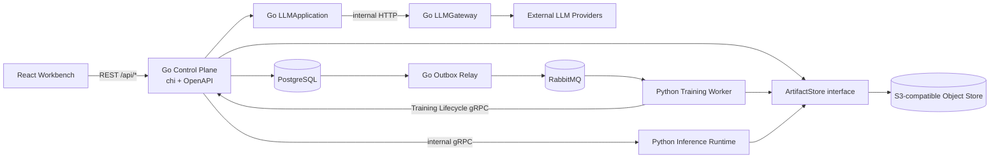

# FineVision 目标技术架构

> 状态：一期核心架构已实现
>
> 日期：2026-09-07
>
> 适用范围：Phase 1
>
> 目标仓库：`FGVCplateformPublic`

本文档定义 FineVision 一期技术栈、Module、interface、seam、工程目录和验证规则。Go Control Plane、Outbox Relay、RabbitMQ、S3-compatible ArtifactStore、Python Compute RPC 和独立 Go LLMGateway 已在本仓库实现；公开 route 的 source contract 以 `go/api/openapi/finevision.yaml` 为准。

文档关系：

- [`REFACTOR_PHASE1_PLAN.md`](REFACTOR_PHASE1_PLAN.md) 定义迁移顺序、状态语义、验收标准和回滚方案。
- [`REFACTOR_PHASE2_PLAN.md`](REFACTOR_PHASE2_PLAN.md) 定义已批准但尚待实施的前端视觉、Training Metric Point、Model Version 比较与 ImageNet backbone 扩展；它不改变本文的 Go/Python 所有权边界。
- [`CONTEXT.md`](../CONTEXT.md) 定义 FineVision 领域语言。
- [`CONTROL_PLANE_API.md`](CONTROL_PLANE_API.md) 与 [`DATABASE_DESIGN.md`](DATABASE_DESIGN.md) 同时保留历史 Python contract 与 Phase 1 Go/internal contract；出现冲突时以 OpenAPI、Protobuf、当前 Alembic head 和本文档为准。

### 0.1 已落地的运行单元

| 运行单元 | 实现 | 入口 |
| --- | --- | --- |
| Go Control Plane | 已实现 | `go/cmd/control-plane` |
| Go Outbox Relay | 已实现 | `go/cmd/outbox-relay` |
| Go LLMGateway | 已实现，独立容器 | `go/cmd/llm-gateway` |
| Python Training Worker | 已实现，RabbitMQ consumer | `finevision.compute.queue_worker` |
| Python Inference Runtime | 已实现，gRPC server | `finevision.compute.inference_runtime` |
| PostgreSQL schema | Alembic head `20260907_0011` | `backend/src/finevision/db/migrations` |
| ArtifactStore | Go/Python Local + S3 adapter | `go/internal/artifact`、`finevision.artifact_store` |

Phase 1 Compose 只把 Go Control Plane 暴露为公开 API；FastAPI 不再是部署服务。历史 Python handler 仅用于未迁移 route 的合同回归，不能作为运行期第二写入者。

## 1. 技术选型

| 领域 | 一期选型 | 用途与约束 |
| --- | --- | --- |
| 公开 HTTP | Go 标准库 `net/http` + [`chi/v5`](https://github.com/go-chi/chi) | Control Plane 与 LLMGateway 的薄 HTTP interface |
| 公开合同 | OpenAPI 3.1 + [`oapi-codegen/v2`](https://github.com/oapi-codegen/oapi-codegen) strict server | 生成请求/响应类型和 Chi server interface；保持现有 `/api/*` 合同 |
| PostgreSQL | [`pgx/v5`](https://github.com/jackc/pgx) + [`sqlc`](https://docs.sqlc.dev/) | 显式 SQL、类型安全 query、事务、`FOR UPDATE` 和 `SKIP LOCKED` |
| 内部 RPC | Protobuf + [`gRPC`](https://grpc.io/docs/languages/go/) | Go/Python 的 Training Lifecycle 和 Inference Runtime interface |
| 消息队列 | RabbitMQ + [`rabbitmq/amqp091-go`](https://www.rabbitmq.com/tutorials/tutorial-one-go) | 训练 Dispatch Message 的发布和竞争消费 |
| 对象存储 | [`AWS SDK for Go v2`](https://docs.aws.amazon.com/sdk-for-go/) S3 client | 通过 S3-compatible seam 连接选定的 MinIO-compatible deployment |
| 日志 | Go 标准库 `log/slog` | 结构化日志和敏感字段控制 |
| Trace/Metric | OpenTelemetry + Prometheus | 跨 HTTP、gRPC、数据库、MQ 和对象存储关联 |
| 配置 | 环境变量 + 小型 typed config package | 启动时一次性校验；不允许请求覆盖基础设施配置 |
| 依赖装配 | 手动 constructor wiring | `cmd/*` 只负责配置、adapter 装配和进程生命周期 |
| 测试 | `testing`、`httptest`、`testcontainers-go` | Module interface、合同、集成和故障恢复测试 |

Go toolchain、generator、container image 和依赖必须固定版本。初次建立 `go.mod` 时选择仍受支持且能够构建已固定 generator 的 Go 版本；此后版本升级必须通过 CI，不使用漂移的 `latest`。

一期不采用：

- Gin、Fiber、Echo 等替代 HTTP 框架。
- GORM 或其他同时隐藏 SQL 与事务的 ORM。
- LangChainGo；LLM provider 使用小型明确的 adapter。
- Redis、Asynq、Celery 或第二套任务队列。
- Go auto-migrate；一期仍由 Alembic 单独拥有 schema migration。
- 全局依赖注入框架或运行时 service locator。

这些不是永久禁令；若要改变，必须用 ADR 说明现有选型造成的实际 friction、替代方案及迁移影响。

## 2. 运行拓扑



关键规则：

- PostgreSQL 是业务状态事实源；RabbitMQ 只携带可重复的 Dispatch Message。
- Go Control Plane 是控制面表的唯一写入者。
- Python Compute Plane 只执行计算、写入未发布对象，并通过 Go interface 提交结果。
- 大文件字节属于 ArtifactStore；PostgreSQL 只保存身份、状态、关系、URI 和完整性描述。
- 外部 LLM 密钥和出站访问只存在于 LLMGateway container。

## 3. Go 工程结构

目标目录：

```text
go/
├── go.mod
├── go.sum
├── cmd/
│   ├── control-plane/
│   │   └── main.go
│   ├── outbox-relay/
│   │   └── main.go
│   └── llm-gateway/
│       └── main.go
├── api/
│   ├── openapi/
│   │   ├── finevision.yaml
│   │   └── generate.go
│   └── proto/
│       ├── training_lifecycle.proto
│       ├── inference_runtime.proto
│       └── artifact.proto
├── db/
│   ├── queries/
│   └── sqlc.yaml
└── internal/
    ├── dataset/
    ├── training/
    ├── artifact/
    ├── model/
    ├── inference/
    ├── review/
    ├── abstention/
    ├── llm/
    └── adapters/
        ├── postgres/
        ├── rabbitmq/
        ├── s3/
        ├── grpc/
        └── llmprovider/
```

目录规则：

- `cmd/*` 不包含业务规则，只装配 config、Module、adapter、server 和 graceful shutdown。
- 每个领域目录暴露一个尽量小而 deep 的 interface；HTTP handler、SQL query 和 SDK 类型不能渗入领域 interface。
- adapter 只能在真实变化的 seam 上存在。例如 ArtifactStore 同时有 LocalFilesystem 与 S3 两个 adapter，因此是实际 seam。
- 不建立 `utils`、`common`、`helpers` 等无领域含义的浅层目录。
- 生成代码集中在 `api` 或 adapter 内，禁止手工编辑；业务 Module 不直接依赖生成的 transport 类型。

## 4. 公开 HTTP interface

### 4.1 Chi 与 OpenAPI

- Chi 只负责 routing 和 middleware composition；业务逻辑进入 Application Module。
- OpenAPI 是公开 request/response 的合同源；生成 strict server interface 和模型类型。
- 保持当前 `/api/*` 路径、HTTP method、snake_case 字段、状态枚举和 response envelope。
- 迁移每批 route 前保存 FastAPI golden response，并对 Go implementation 做兼容测试。
- handler 只执行 decode、调用 Application Module、把稳定错误映射为 HTTP response。

### 4.2 Middleware 顺序

推荐固定顺序：

1. trusted proxy / real IP policy
2. request ID
3. panic recovery
4. access log 与 trace context
5. body size limit
6. authentication / authorization（启用后）
7. route-specific timeout
8. OpenAPI request validation

不对长时间训练设置 HTTP handler 等待。单图 inference 可以同步调用内部 Inference Runtime；Dataset ingest 和 batch inference 必须创建异步 Job。

### 4.3 错误合同

一期统一错误 envelope：

```json
{
  "error": {
    "code": "INVALID_STATE_TRANSITION",
    "message": "training job cannot be resumed from succeeded",
    "details": {},
    "request_id": "req_..."
  }
}
```

- `code` 稳定，可被前端和 Worker 分支处理。
- `message` 面向操作者，不包含 secret、SQL、绝对路径或对象存储凭证。
- `details` 只包含安全的结构化诊断。
- transport error 与领域错误集中映射，不能由各 handler 自由拼接。

## 5. PostgreSQL 与事务

### 5.1 pgx + sqlc

- 使用 pgx native pool，不通过 `database/sql` 再包一层。
- SQL 保存在 `go/db/queries/`，sqlc 生成类型安全调用。
- Repository adapter 可封装读取；跨表业务事务由对应 Application Module 拥有。
- 时间、lease 到期和 `available_at` 判断使用 PostgreSQL 时间，避免 Worker 时钟漂移。
- 状态更新使用 row lock、版本/epoch 条件或明确 CAS，禁止 read-then-write 的无锁竞争。

### 5.2 Migration owner

一期继续使用现有 Alembic migration：

- Go 启动时只检查 schema compatibility，不创建或修改表。
- Go 与 Python 不得各自维护一套 migration 历史。
- 移除 Fine-R1 表使用新的 forward migration，不修改已经发布的 migration。
- 等 Python Control Plane 完全删除后，再通过 ADR 评估是否迁移到 Go migration tool。

### 5.3 Transactional Outbox

创建或重新派发 Training Job 时，同一 pgx transaction 必须提交：

1. Training Job / Training Run 状态
2. Job Event
3. Outbox Event

Outbox Relay 使用短事务和 `FOR UPDATE SKIP LOCKED` 领取事件，在事务外发布 RabbitMQ，收到 publisher confirm 后再写 `published_at`。Outbox 是可靠派发机制，不是 Training Lifecycle 状态机。

## 6. Go 与 Python interface

### 6.1 gRPC 使用范围

内部 gRPC 只用于需要强合同的 Go/Python调用：

```text
TrainingLifecycle
  Claim
  Heartbeat
  ReportProgress
  Complete
  Fail

InferenceRuntime
  Predict
  PredictBatchStream（一期后段）
  EvictCache
  Health
```

所有 operation 必须传播 deadline、request ID、Job Attempt、execution epoch 和 trace context。内部调用使用 container identity/shared internal credential；不能把内部 gRPC port 暴露给浏览器。

### 6.2 Protobuf 合同

- `ArtifactDescriptor`、`Prediction` 和 Training Lifecycle command 使用 Protobuf 定义。
- Protobuf 字段只追加，不复用已删除 field number；破坏性变化发布新 package version。
- Protobuf message 不携带图片、模型或特征矩阵大字节，只携带 URI、SHA-256、大小和必要 metadata。
- 领域 Module 使用自己的类型，在 gRPC adapter 集中转换 transport 类型。

### 6.3 RabbitMQ 消息合同

Dispatch Message 使用可观察的小型 JSON：

```json
{
  "message_id": "msg_...",
  "event_type": "training.job.ready",
  "schema_version": 1,
  "job_id": "job_...",
  "dispatch_generation": 3,
  "occurred_at": "2026-09-07T00:00:00Z"
}
```

完整训练配置在 claim 成功后由 Go 返回。Consumer 必须容忍重复消息；未知 schema 或不可解析消息进入 DLQ，训练业务失败写回 PostgreSQL。

## 7. ArtifactStore 与 MinIO

### 7.1 Go S3 adapter

定义与 SDK 无关的 ArtifactStore interface，例如：

```text
PutStaged
Head
OpenVerified
Promote
DeleteStaged
PresignGet
PresignPut
```

S3 adapter 内部使用 AWS SDK for Go v2，并把 endpoint、region、path-style、TLS 和 credential provider 放在 typed config。业务 Module 不得导入 AWS 或 MinIO SDK 类型。

### 7.2 完整性

- canonical identity 使用 SHA-256 + `size_bytes`，不能使用 ETag 代替。
- 上传前由生产者流式计算；上传后校验 HEAD 大小和对象存储 checksum。存储不提供独立 checksum 时，执行一次流式读回。
- inference/training materialize 在 cache miss 时下载到临时文件，边读边校验，成功后原子 rename 到 `cache/sha256/{hash}`。
- SHA 或大小不匹配必须 fail closed，不能产生 ready Artifact、succeeded Training Job 或 Model Version。
- canonical URI 保存为 `s3://bucket/key`；presigned URL 只在请求时短暂生成。

### 7.3 两个 adapter

- `LocalFilesystemArtifactStore`：单元测试、离线开发和旧数据迁移。
- `S3ArtifactStore`：Compose 和生产部署，连接选定的 MinIO-compatible object store。

生产新写入只允许 S3 adapter；LocalFilesystem adapter 不作为长期生产 fallback。

## 8. LLMGateway

LLM 能力分为两个 Module：

- `LLMApplication`：位于 Control Plane，拥有业务 prompt、上下文裁剪、脱敏、advisory invariant 和结果持久化。
- `LLMGateway`：独立 Go container，拥有 provider adapter、credential、timeout、retry、fallback、限流、用量和结构化输出 transport。

Provider seam 使用小型内部 interface，不引入 LangChainGo：

```text
GenerateText
GenerateStructured
GenerateMultimodal
```

只有确有两个 provider implementation 时才抽取共享 adapter seam。重试只覆盖连接中断、明确的临时错误和 provider 限流；请求必须带幂等标识，不能无上限重试。LLM Assistance 永远是 advisory，不能提交人工 Review、修改最终标签或激活 Abstention Policy。

## 9. 可观测性与安全

- HTTP、gRPC、Outbox Event、RabbitMQ message、Job Attempt 和 Artifact 使用关联 ID。
- `slog` 输出 JSON；开发环境可以使用 text handler。
- OpenTelemetry 负责 trace 和 metric，Prometheus 抓取运行指标。
- health 只表示进程存活；readiness 检查必要 dependency，但必须有短 timeout。
- secret 只从环境变量或 secret file 读取，不能进入 OpenAPI、Job payload、数据库结果、日志或前端 bundle。
- LLMGateway 是唯一持有外部 LLM credential 和默认出站权限的 Module。
- 对象存储 bucket 默认私有；前端不持有永久 S3 credential。

## 10. 测试策略

### 10.1 Go

```bash
cd go
go test ./...
go vet ./...
```

- Module 通过自身 interface 测试业务状态与错误，不直接测试私有函数实现细节。
- pgx/sqlc、RabbitMQ、S3 和 gRPC adapter 使用 integration tests；需要真实语义时使用 testcontainers，不用过度理想化 mock。
- ArtifactStore 的 LocalFilesystem 与 S3 adapter 必须通过同一组 interface contract tests。
- OpenAPI 和 Protobuf 生成结果在 CI 检查无漂移。
- Outbox、重复消息、fencing、cancel/complete 竞争和 Artifact 篡改必须有故障测试。

### 10.2 Python

```bash
uv run --group dev pytest
uv run --group dev python -m finevision.ml_toolkit.smoke --work-dir .finevision-smoke
```

Python tests 重点覆盖计算确定性、Artifact 合同、gRPC adapter 和 Worker 崩溃恢复；新测试不能依赖直接修改控制面表来伪造正常执行流程。

### 10.3 Frontend

```bash
cd frontend
npm run build
npm run smoke:api-client
npm run smoke:routes
```

迁移 route 时更新 client contract smoke；删除 Fine-R1 时同步删除对应 client、页面入口和 smoke script。

## 11. 依赖与生成代码规则

- 所有 Go dependency 和 tool 使用 `go.mod`/`go.sum` 固定；generator 使用 `go tool` 或仓库脚本，不要求全局安装。
- 不在源文件中使用 `@latest`；升级依赖单独提交并运行完整验证。
- 生成文件必须带 generated header，禁止手改。
- OpenAPI、Protobuf、sqlc 的源合同与生成结果一同提交。
- 添加新的第三方 Module 前先证明标准库或当前选型无法满足 interface，并记录许可证。
- Go Control Plane image 不包含 Python、CUDA、PyTorch、`timm` 或模型权重。

## 12. 实施顺序

1. 固定 OpenAPI、Protobuf、Artifact Descriptor 和错误合同。
2. 建立 Go workspace、Chi server、typed config、slog、health/readiness 和 CI。
3. 建立 pgx/sqlc adapter，先迁移只读 route。
4. 建立 ArtifactStore 两个 adapter及完整性测试。
5. 实现 Training Lifecycle、Transactional Outbox 和 Outbox Relay。
6. 接入 RabbitMQ consumer，撤销 Python 控制面表写权限。
7. 建立独立 LLMGateway，迁移全部外部 LLM 调用。
8. 建立 Python Inference Runtime gRPC interface，完成公开流量切换。
9. 删除 FastAPI Control Plane 和所有 Fine-R1 vertical slice。

每一步必须满足 [`REFACTOR_PHASE1_PLAN.md`](REFACTOR_PHASE1_PLAN.md) 对应退出条件，禁止用一次性“大爆炸”替换整个后端。

## 13. Phase 2 已实现扩展

Phase 2 保持以上 Go/Python 所有权边界，并在现有事实源上增加以下能力。

### 13.1 Training Metric

- Python `torch_linear_adam` 每个 epoch 通过 `ReportProgress` 上报 `train_loss` 与
  `eval_accuracy`；每个点携带 `attempt_id`、`step` 和上下文。
- Go 在 fencing 校验后把指标追加到 `training_metric_points`，唯一键保证重复 RPC 幂等；过期
  attempt 不能污染新曲线。
- `GET /api/training-runs/{run_id}/metrics` 使用 cursor 增量读取并返回 `poll_after_ms`。前端以
  2 秒为默认周期，终态后停止轮询，Ridge Linear 不生成伪造曲线。
- ECharts 只是渲染 adapter；PostgreSQL 与 Go API 仍是 Metric 事实源。

### 13.2 Model Version Registry

- `go/internal/modelregistry` 拥有 candidate → staging → production、archive、alias 和比较规则。
- `champion` 只能指向 production，`challenger` 只能指向 candidate/staging；alias 在 Dataset
  作用域内唯一，并在同一事务中重指向和写入审计事件。
- 比较请求接受 2–5 个版本。只有 Dataset Version、evaluation split 和 protocol fingerprint
  都一致时才标记为可比较；缺失指标返回 N/A 语义，不转换成 0。
- PostgreSQL 保存 backbone、预训练来源、Feature 维度、输入尺寸、参数量、head 类型和评估上下文，
  供列表、详情和比较页使用。

### 13.3 受管 Backbone 与 Artifact 两层管理

`go/internal/modelcatalog` 固定三项可选身份：

```text
dinov3_vits16_lvd1689m
imagenet_vits16_augreg_in21k_ft_in1k
imagenet_resnet50_a1_in1k
```

权重由 Git LFS 发布，以 immutable upstream revision、许可证、SHA-256 和大小登记在
`weights/manifest.json`。Compose 的 `pretrained-weight-init` 将其校验后提升到 MinIO；Training
Worker 与 Inference Runtime 只按稳定 key 按需 materialize。

训练产物同时具备两层身份：

1. 逻辑层：Artifact Record 绑定 Dataset Version、Training Run、attempt 和 Model Version。
2. 物理层：MinIO 使用 `compute/{artifact_type}/{sha-prefix}/{sha256}` 一类内容寻址 key 保存字节。

Inference Runtime 要求 Model Bundle、Model、Feature/Strategy Artifact 的逻辑 scope 完全一致，
并逐个验证 SHA-256 与大小。引用安全 GC 只有在没有任何 Artifact Record 或训练/模型/推理关系
引用同一 SHA 时才允许删除物理对象。

### 13.4 前端结构

- A「科研实验工作台」已落实为 `frontend/src/design-system` 的语义 token、通用组件和图表 adapter。
- Training 与 Model Version 页面分别位于 `frontend/src/features/training` 和
  `frontend/src/features/model-versions`，生产 route 不依赖原型目录。
- 桌面端使用固定导航和高密度工作区；窄屏切换为图标导航与纵向 panel，表格保留横向滚动能力。
